# 01 故事的开始

## 对白

### 对白设计

『. . . . . .』(表示两人沉默)

『呐. . .』（赖津美）

『我们就在这里再见吧. . .』（赖津美）

. . . . . . (表示两人沉默，个人认为这里保持『』括号格式会更加统一)

『或许很快就能再见了. . .』（赖津美）

嗯. . . （故事主人公，我）

『谢谢你一路陪我. . .』（赖津美）

### 实现

选取一个对白进行分析，其余原理类似。

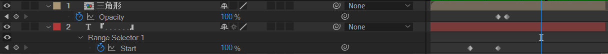

- 三角形合成里面，利用形状层制作一个三角形，给Y rotate添加表达式进行循坏旋转。
- 文本层，使用范围选择器K帧：0-100，实现淡入。

## 流云

### 流云的制作

- 调节层3：添加色相饱和度，降低饱和度。
- 调节层2：添加快速模糊，绘制mask，使得画面下面区域模糊，上面区域清晰。
- 调节层1：添加渐变:上黑下白；添加Noise，制作画面颗粒感。
- 底层2：复制底层1，去掉tritone着色，保持黑白色调，s稍微放大比例。降低opacity，使用overlay模式对底层进行叠化。
- 底层1：分型杂色制作Y方向up-down（通过分形杂色的offset选项）的流云。使用tritone着色。

效果如下：

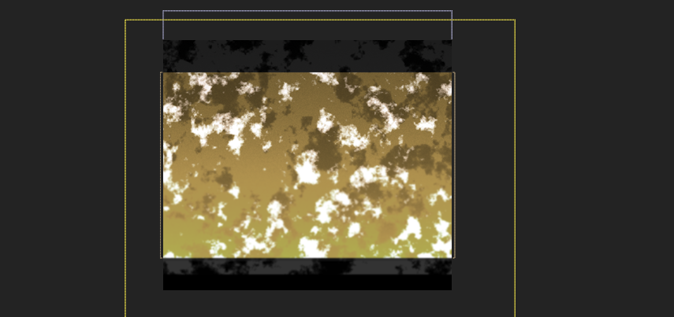

### 摄像机合成

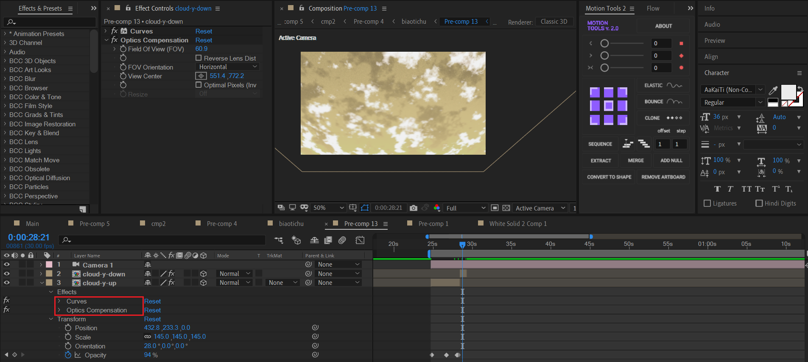

- 给cloud-y-up 制作开场淡入和出场轻微淡出的效果。

- 给cloud-y-up 打开3D，添加曲线和光学补偿效果。曲线不多说，这样光学补偿是为了制作类似镜头扭曲（广角畸变）的摄影效果。

- 新建一个摄像机。将cloud-y-up的position属性复制给摄像机，然后修改摄像机position的Z属性到合理距离。

  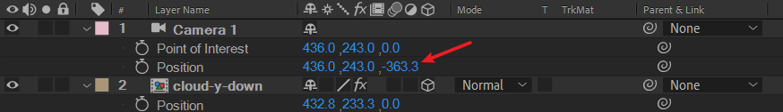

- 在流云Y上移和Y下移的时间点进行打断。

这样，就完成了背景流云上移然后突然下移的效果。

## glitches

### 背景

以其中一个合成1作为例子进行分析：

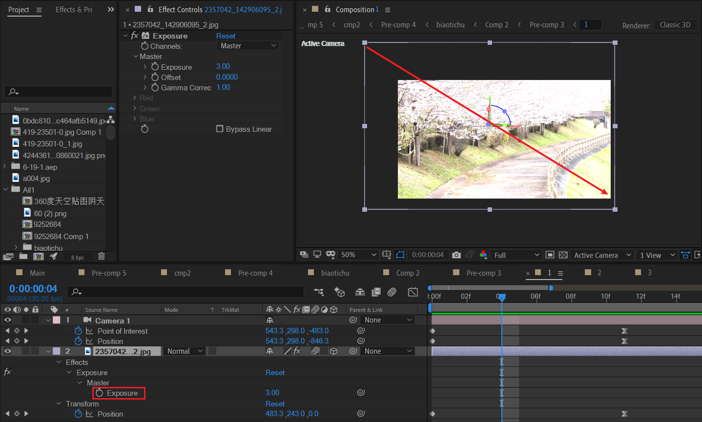

- 图层图层打开3D，新建摄像机K帧，制作以图片右下角为锚点的缩小动画。
- 图片图层添加曝光。

---

创建3组这样的单独合成，作为整体背景。其中合成之间过渡采用叠化。

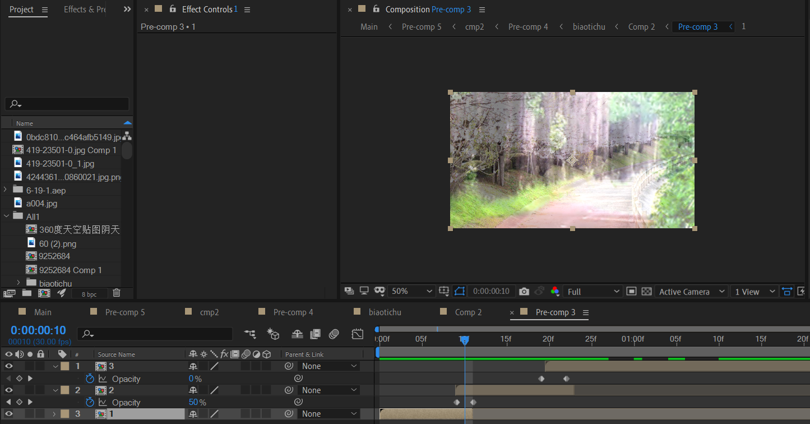

### 摄像机动画

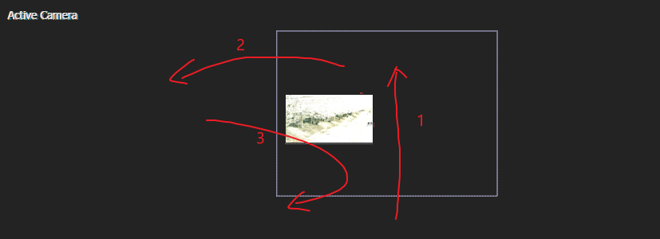

### 背景图片叠加+wiggle

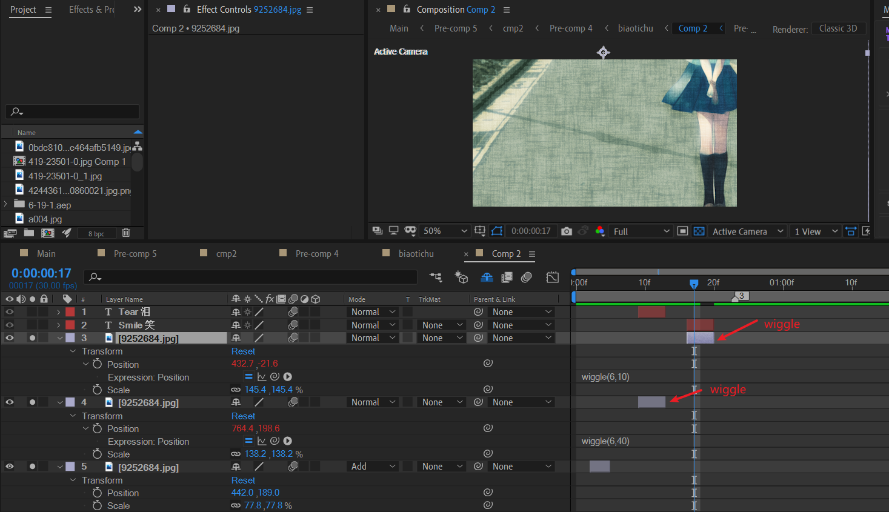

### 文案

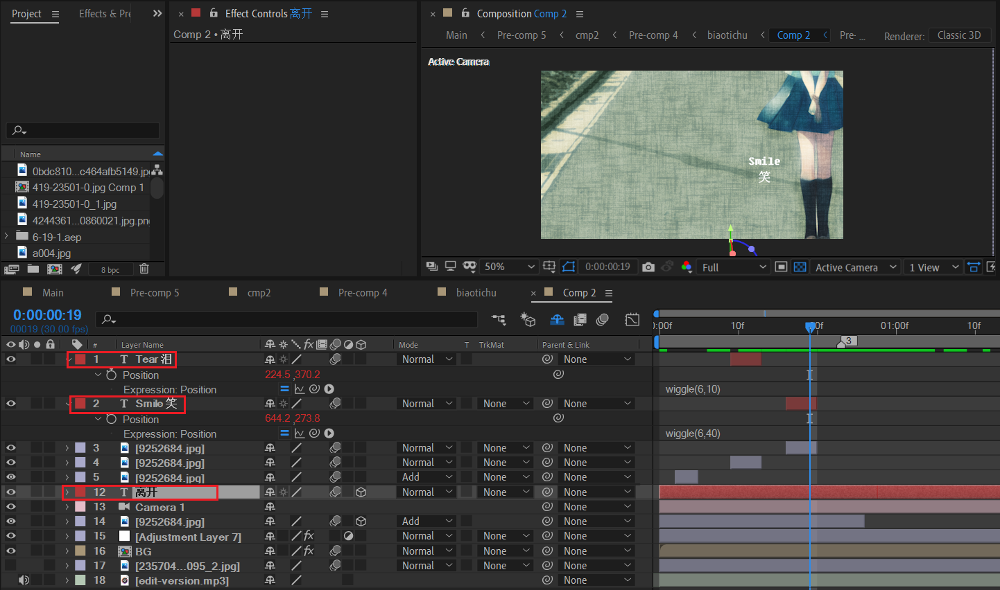

- 泪与笑，不是3D图层，因此给了wiggle抖动。

- 最后是居中的两个字——离开。这个是3D图层，保证后面出现于画面中间。

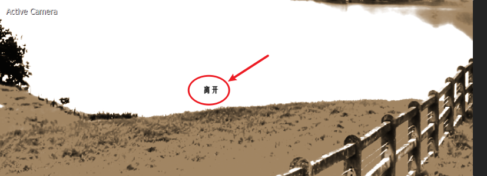

### 标题

在合适的时刻，淡入处理。

### 调色

首先对glitches合成进行独立调色。

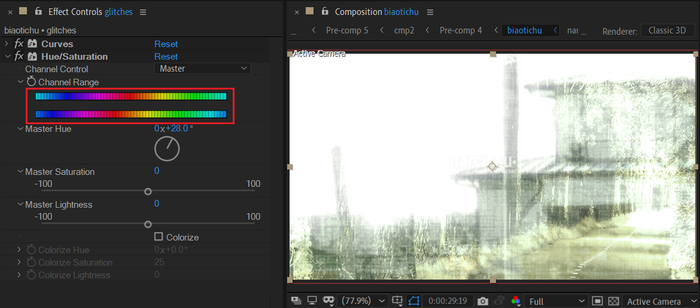

主要使用色相偏移，使得画面变得具有青苔那种破落感。

### 整体调节层（关键）

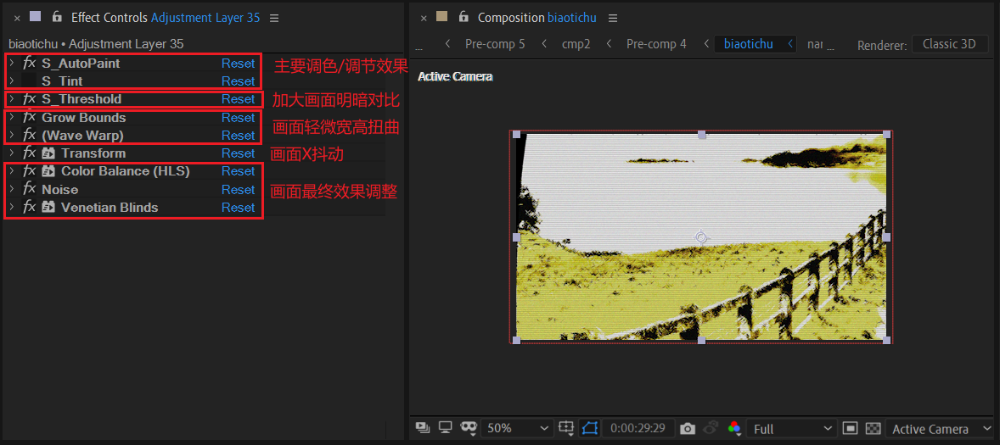

上面截图中，S_Tint效果没有打开。

现在，将S_Tint打开后，进行下面的K帧。

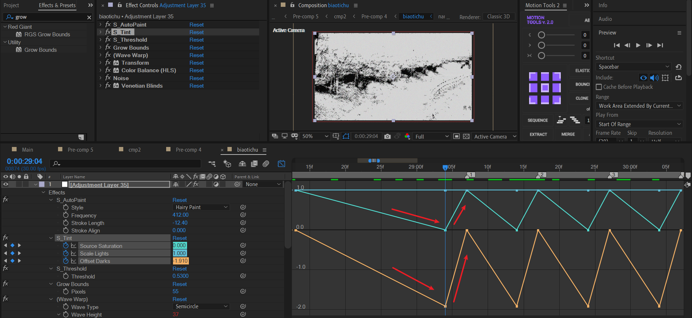

这里目标是制作【黑白化-恢复正常】反复的效果。于是，可以看到值曲线（saturation & offset darks）先下降然后上升。

## 女主出场

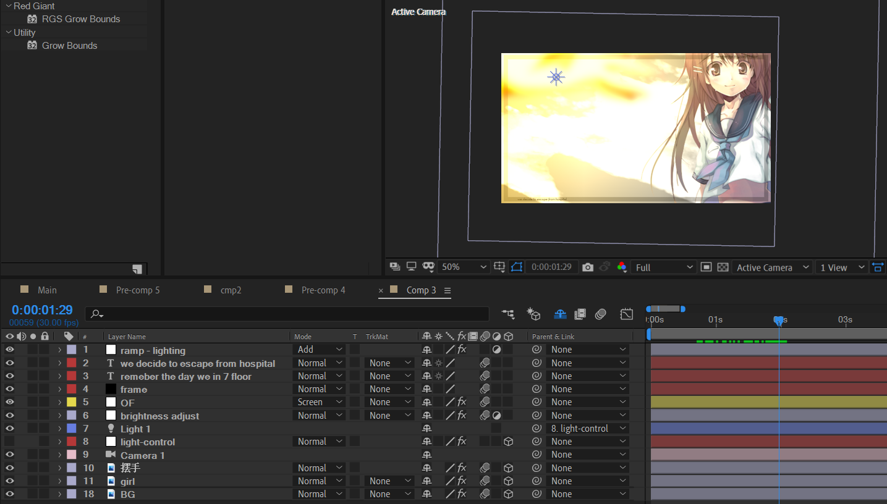

这里主要动画为：摄像机旋转+摄像机拉远。女主角从右侧入场。

左上角有一个伸手的动画，模糊化处理，作为前景。

建立一个点光源放于左上角，新建一个OF光跟随这个点光源。OF图层使用【伸手】图层作为前景。

---

顶层的调节层（ramp-lighting)利用梯度渐变来打光。

| 前                                                           | 后                                                           |
| ------------------------------------------------------------ | ------------------------------------------------------------ |
| 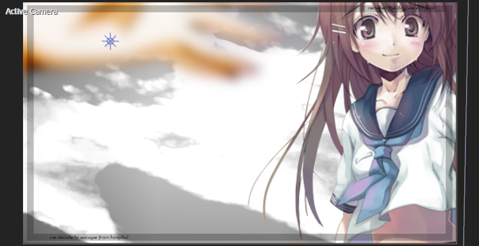 | 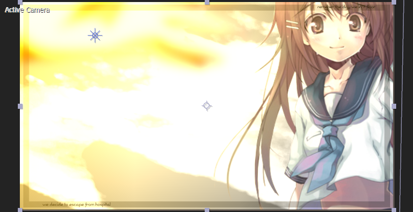 |

渐变示意图如下，同时需要设置一个合理的图层模式，这里是Add。

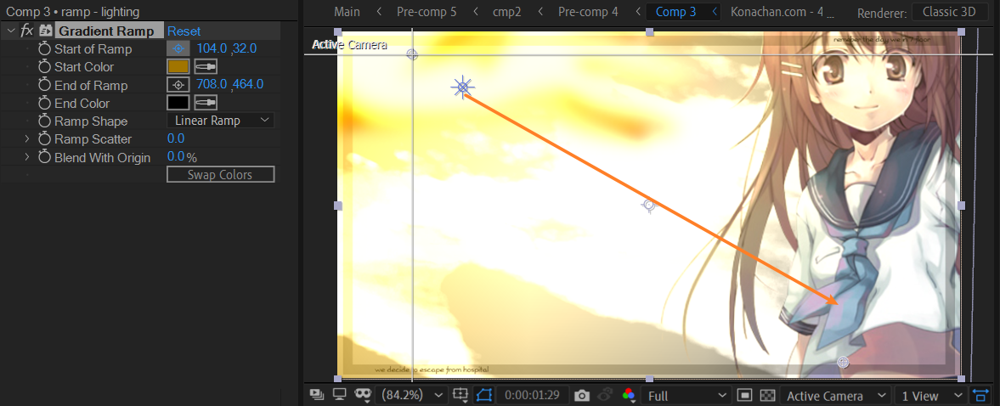

---

整体效果。

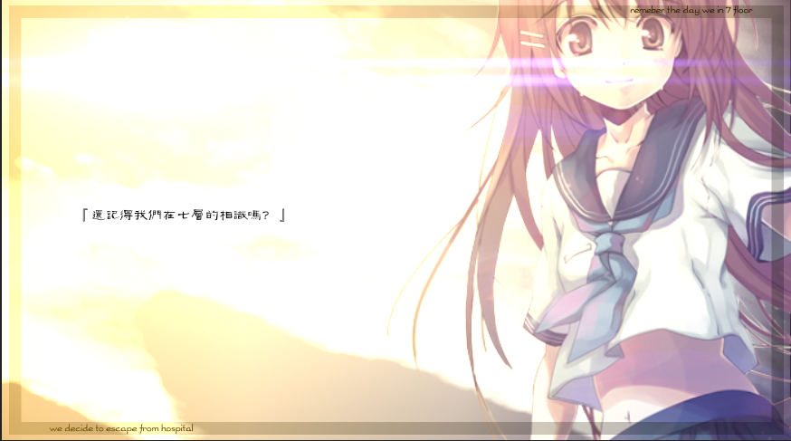

## 故事的开始

### 道路延伸

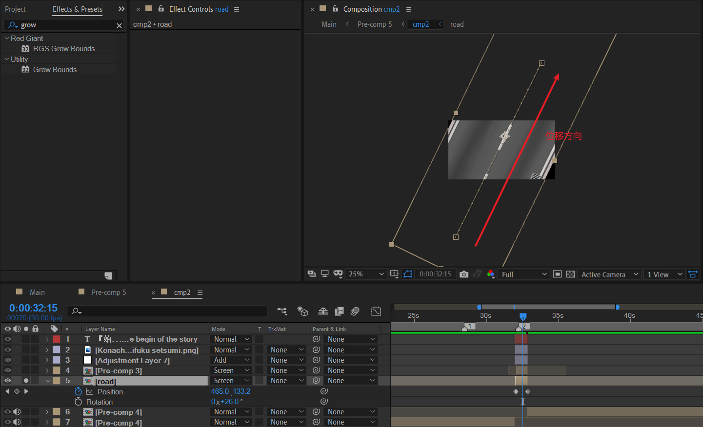

### 粉色背景

快速模糊+湍流置换。

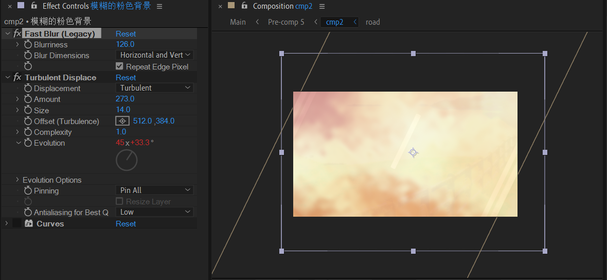

### 文案

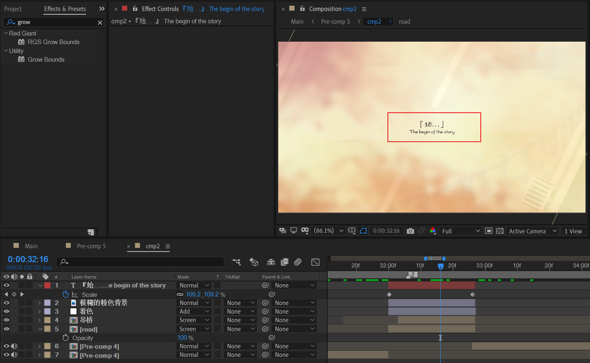

采用方正古隶字体，具有很浓的文艺感。

