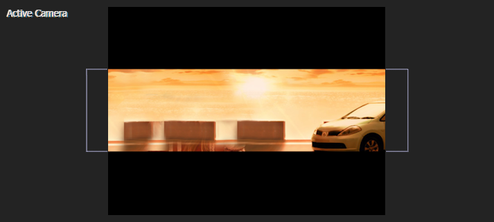
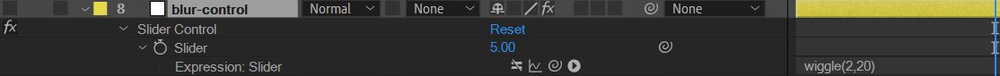
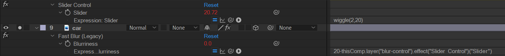
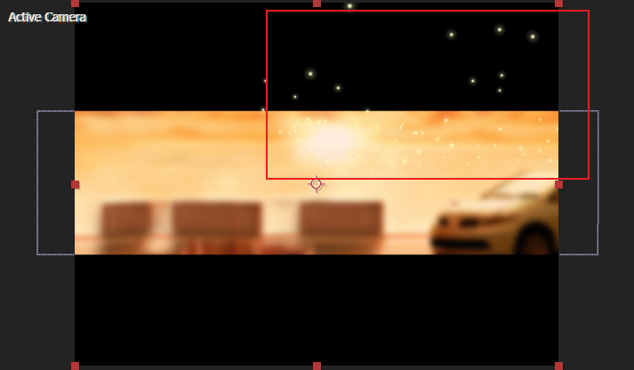
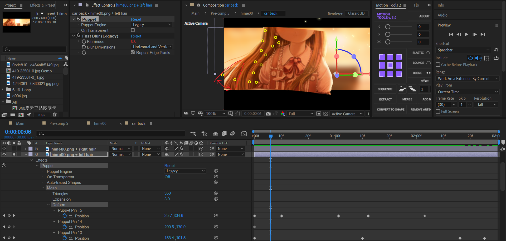
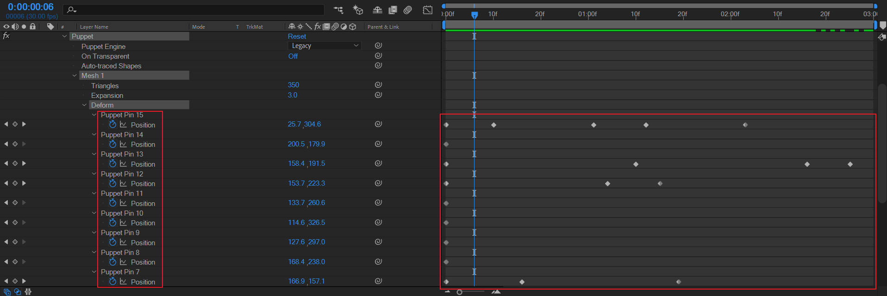
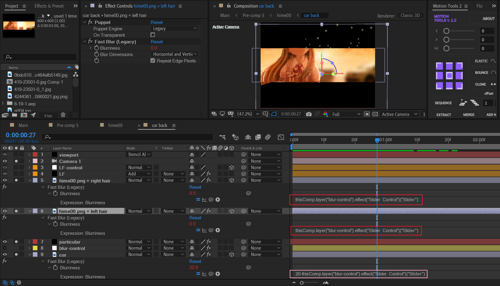
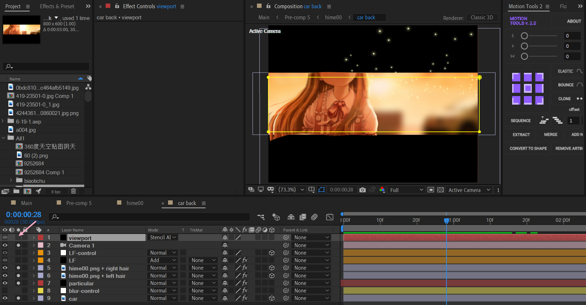
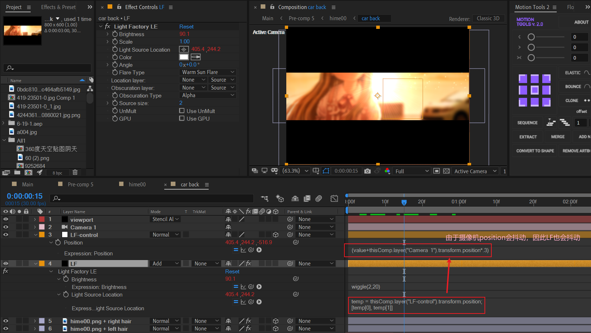
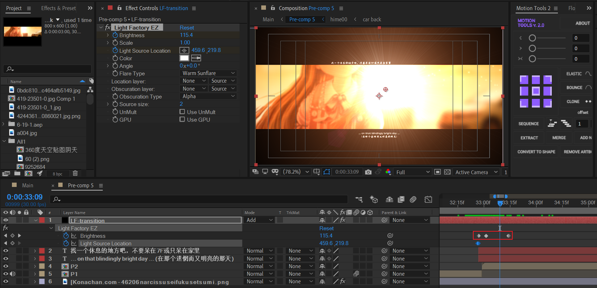

# 02 姬子

## 背景模糊抖动

采用空对象的滑块控制+AE表达式链接来实现。

导入背景图片：



创建空对象，添加滑块控制：



注意wiggle表达式为：

```js
wiggle(2,20)
```

其中振幅为20，也就是抖动变化范围是[-20,+20]。当设置初始值为5时，最终变化范围为[-15,+25]。

---

给背景图片添加模糊效果，并且链接模糊值到之前的滑块控制。



这里，背景图片blur值的表达式：

```js
20-thisComp.layer("blur-control").effect("Slider Control")("Slider")
```

根据上面计算的变化范围，最终背景blur变化为：[-5,35]。事实上，blur值恒大于等于0，因此真实有效的blur范围是：[0,35]。


## particular粒子



在右侧区域制作一个p粒子随机飘动的效果。粒子类型选用glow sphere，或者采用普通粒子+glow效果实现发光。


## 原生木偶实现头发飘动

使用AE自带的puppet tool手动制作头发飘动。如今可能你会想到使用auto sway插件一波带走，但是个人认为了解一下真正的木偶原理还是非常有必要的。



预览窗口中，黄色的点就是木偶工具的控制点。

将关注点放于画面左侧的头发发梢位置，红色箭头表示的是头发缓慢飘动的运动路径。

---

现在，我们来看下木偶工具的关键帧。本质上，控制的是每个控制点的position的变化。




## 前后背景交替模糊



给前景人物图层（index 5,6）添加blur效果，链接到blur-control空对象。现在，我们观察表达式：

- 前景：`thisComp.layer("blur-control").effect("Slider Control")("Slider")`
- 背景：`20-thisComp.layer("blur-control").effect("Slider Control")("Slider")`

也就是前景blur等于滑块的值，背景blur等于20减去滑块值。举例：当滑块值为0时，前景清晰，背景模糊（模糊值为20）。


## 适当裁剪viewport



做完大体的画面效果后，使用压黑边方式裁剪画面区域边缘。


## LF光

这里，LF光指的是光工厂插件（ Light Factory LE）。这是一个比较古老的打光插件，我们现在熟悉的应该是Optical Flares插件。



LF图层的灯光位置绑定到空对象LF-control，而LF-control绑定到摄像机的位置（*0.3表示削弱权重），因为摄像机之前设置了position的wiggle，因此结果是：LF图层灯光位置也会轻微抖动。

此外，LF层设置了Brightness的抖动，因此灯光光晕也会表现出变大-变小的尺寸变化。


## P1-P2：LF白化过渡



- 使用LF对亮度进行K帧（0- ？-0），实现白化过渡。
- 两个描述文本。

