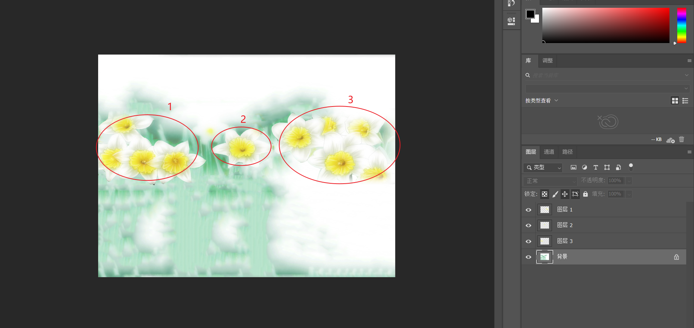
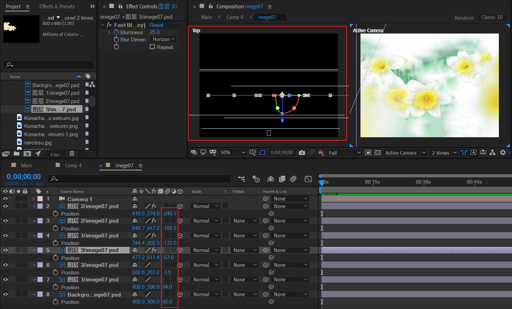
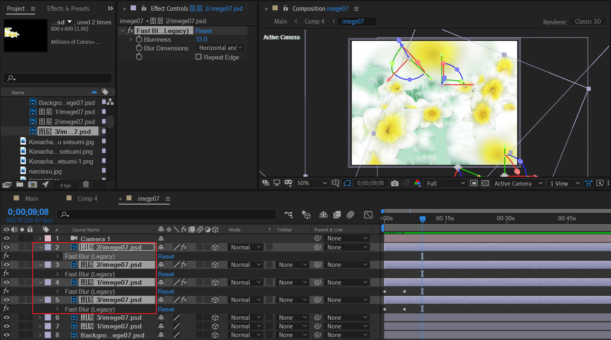
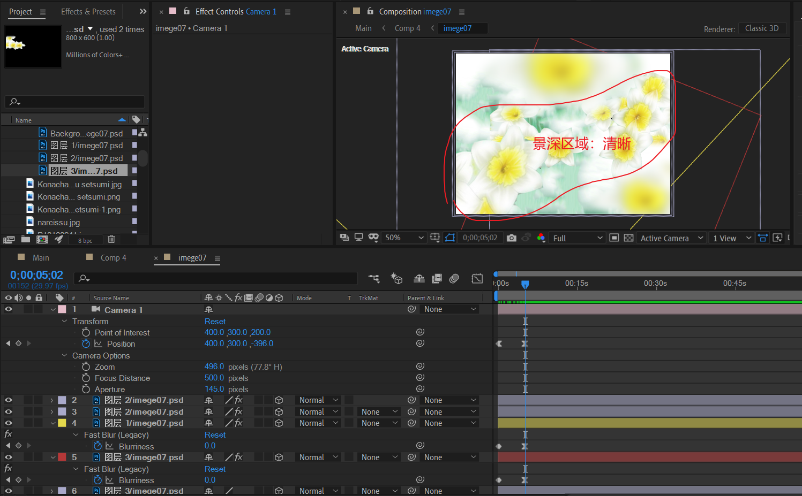
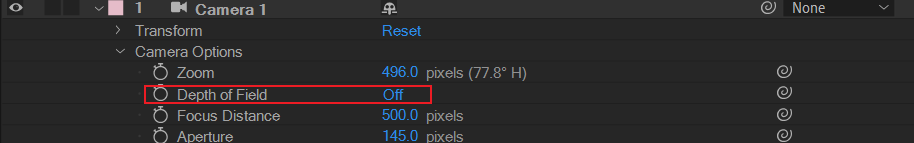
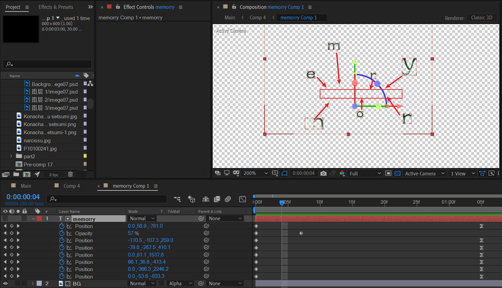
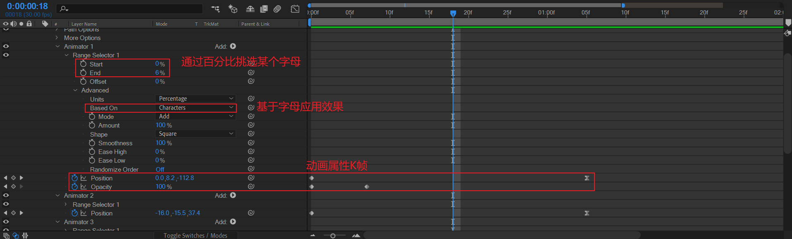
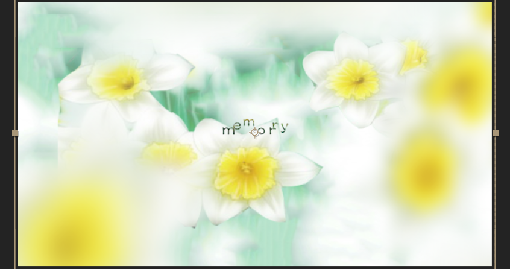

# 03 水仙

## 水仙花海

### 图层素材

在PS中创建水仙花海：

- 背景：一个白色的水仙花远景作为底层背景，注意要模糊处理。
- 前景：寻找抠图后的水仙花，例子中是3朵。

### 摆放景深位置

### 前景图层模糊处理

### 镜头拉远与景深模拟

什么是景深？

> **景深**（英语：Depth of field, DOF）景深是指相机对焦点前后相对清晰的成像范围。在[光学](https://zh.wikipedia.org/wiki/光學)中，尤其是[录影](https://zh.wikipedia.org/wiki/錄影)或是[摄影](https://zh.wikipedia.org/wiki/攝影)，是一个描述在空间中，可以清楚成像的距离范围。虽然[透镜](https://zh.wikipedia.org/wiki/鏡頭)只能够将光聚到某一固定的距离，远离此点则会逐渐模糊，但是在某一段特定的距离内，图像模糊的程度是肉眼无法察觉的，这段距离称之为景深。

这里是一种伪景深的实现。

因为摄像机的DOF开关实际上没有激活。

景深区域的清晰度控制和非景深区域的模糊是人工编排的，因此称为伪实现。

## 字母汇聚动画

- 新建文本。

- 添加动画范围选择器，关键设置如下；

  

> 注意：这里memorry单词疑似TYPO，正确的应该是memory。

预览效果。

