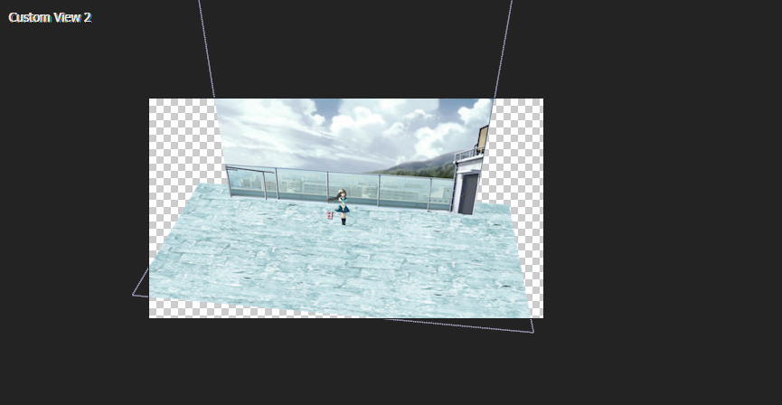
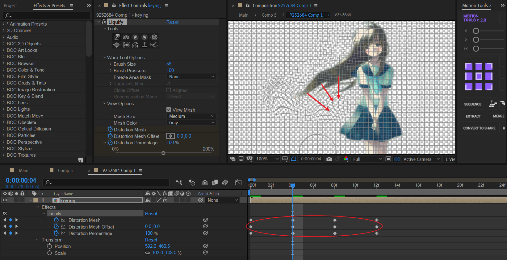
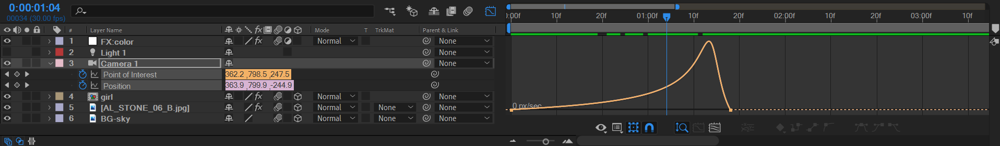
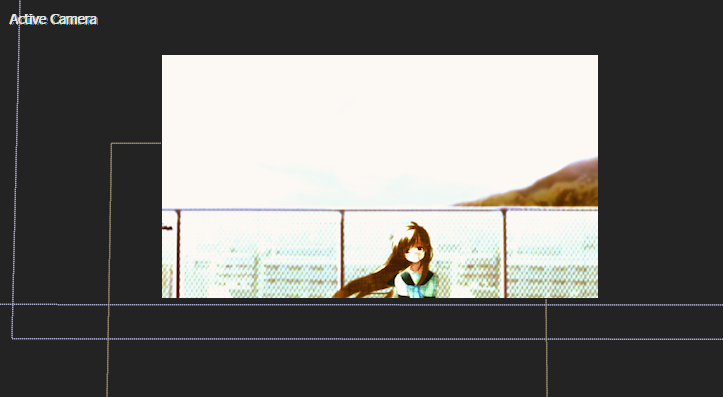
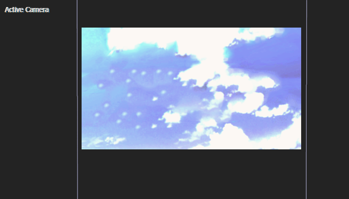
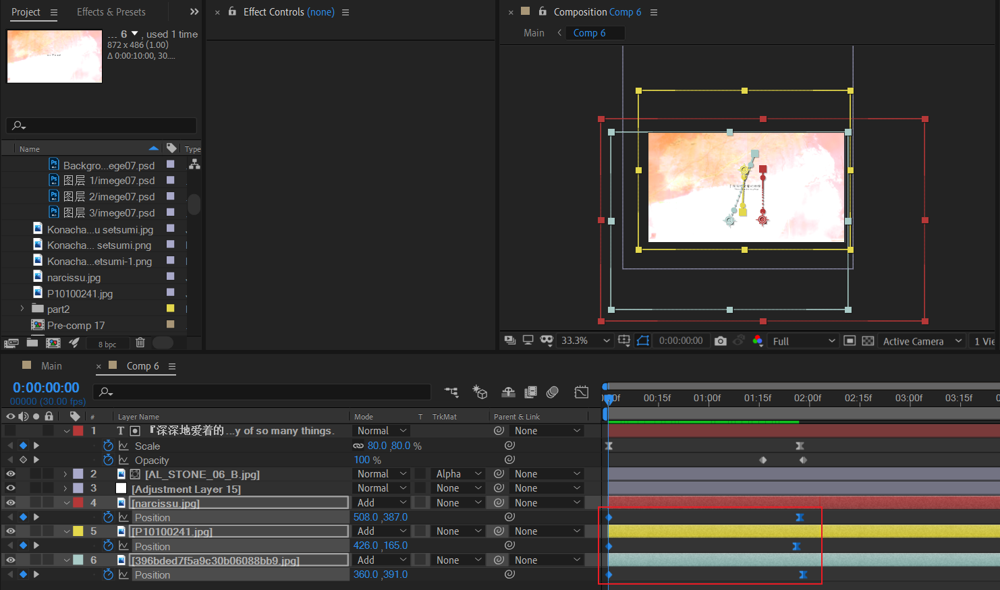
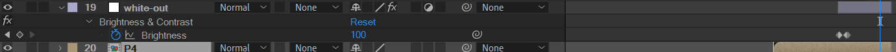

# 04 天台与女孩

## 搭建天台环境

## 头发飘动——液化

使用AE插件Liquify对头发末梢区域进行细微的扭曲拉伸，伪造头发飘动的效果。提示：打开网格可视化可以辅助观察扭曲的程度。

## 摄像机动画

左视图观察：摄像机从下往上进行空间曲线路径的移动，同时镜头是拉远。

关键帧速度曲线如下：

---

最后，显示天空。

## 背景叠化+交错位移

两个关键点：

- 背景图层的图层模式一律设置Add，图层合理设置opacity。
- 背景位移方向交错。

## 白化出场

