# 05 赠予白色的塑料手环

## bracelet 合成内部

### 海滩沙地

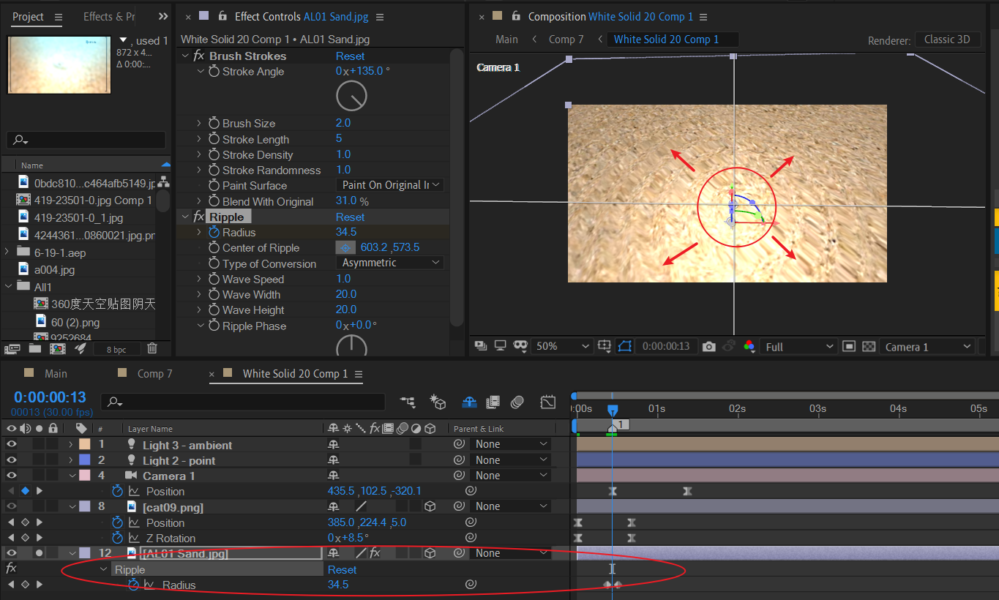

- 寻找一张海滩沙地图片作为背景素材，打开3D后，设置X轴倾斜度。
- 添加brush strokes效果：实现画笔描边效果。
- 添加ripple效果：将波纹中心定于图中位置，对radius属性K帧增大，实现波纹扩散。


### 白色手环

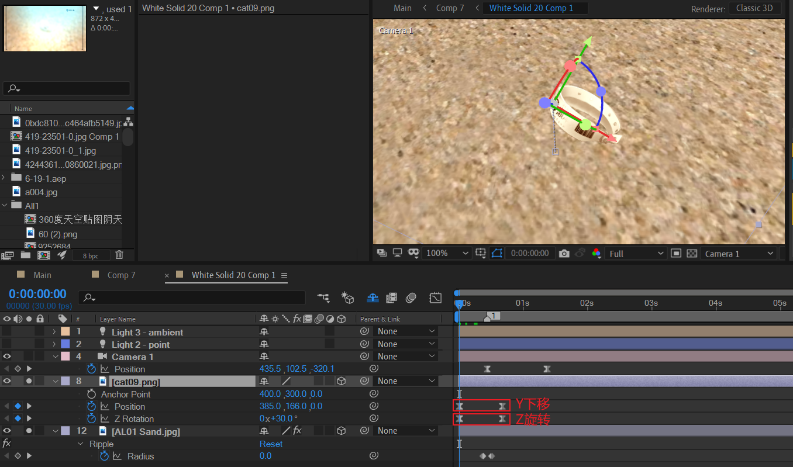

这里，主要是模拟手环掉落海滩水中的场景。

对Y位置下移；将锚点定义手环左侧，对Z轴旋转。


### 摄像机动画

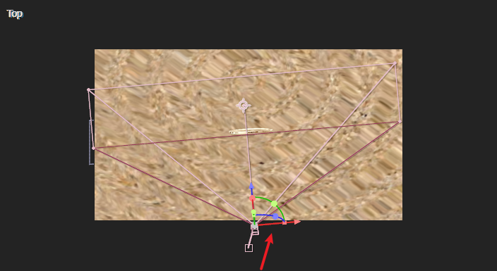

保持目标点不动，摄像机位置往右，同时往里稍微推近。


### 打光

#### 点光

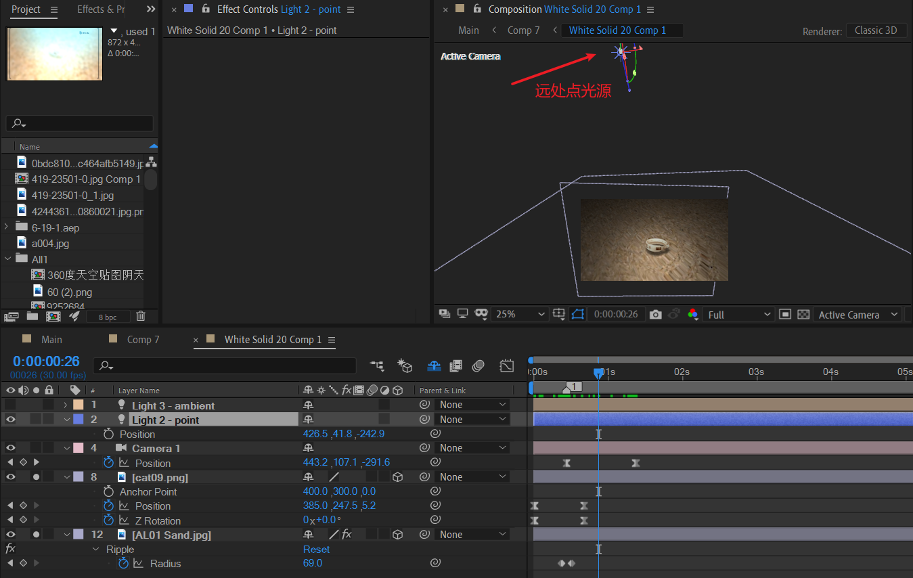

在场景上方放置一个白色的点光源，注意打开光源的casts shadows和其他素材接收灯光的设置。

此时，可以看到以手环为视觉焦点，灯光向四周径向衰减变暗。

因此此时场景显得比较暗，于是应该考虑使用环境光打亮整体。


#### 环境光

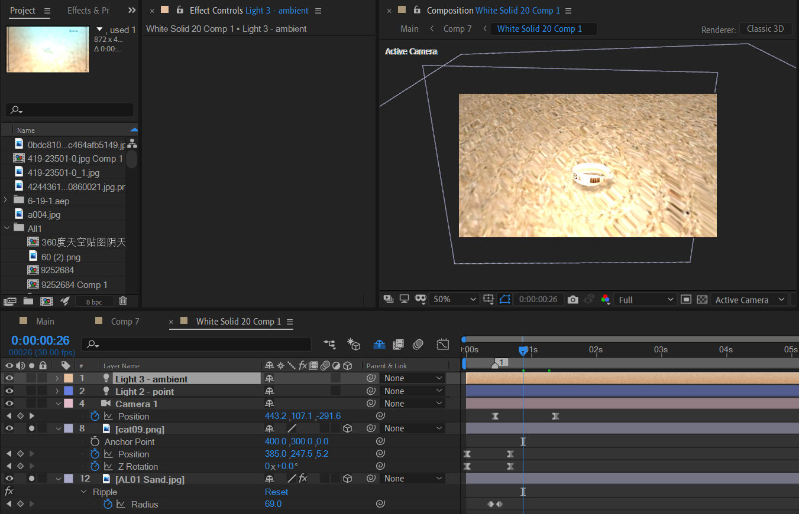

上面均是bracelet合成内部的制作。


## bracelet 合成

### 提亮灯光效果

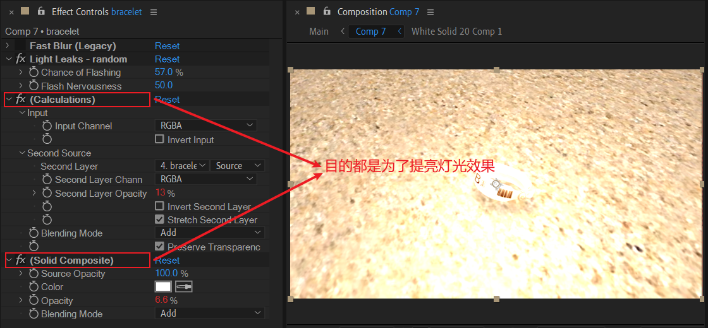

在外层中，对bracelet 合成添加计算和固态组合效果。这里两个效果都是设置ADD模式，加亮灯光。

下面我们来看下AE表达式和上面的Light Leaks -random的作用。

> 参阅：
>
> - [Light leak 概念](https://en.wikipedia.org/wiki/Light_leak)
> - [Light leaks 在AE中的一种简单实现：分型杂色](https://youtu.be/5bkg1LEbeUk) 

Light Leaks 就是漏光。根据维基百科的介绍，它是摄像机元件缺陷导致的一种光线穿透现象。通常出现在劣质的相机中。

在AE中，模拟这种现象有时却被认为是积极的。

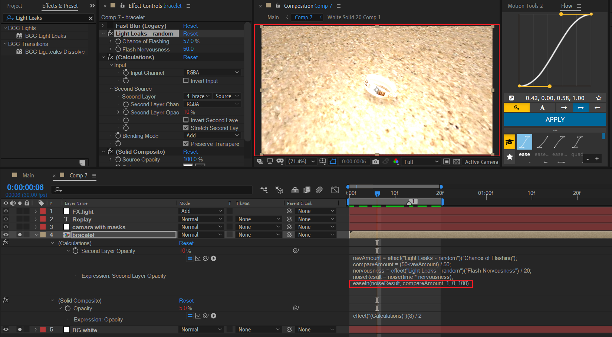

Light Leaks - random 效果是哪个？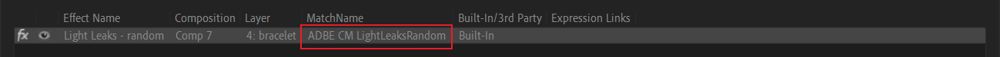

```js
rawAmount = effect("Light Leaks - random")("Chance of Flashing");
compareAmount = (50-rawAmount) / 50;
nervousness = effect("Light Leaks - random")("Flash Nervousness") / 20;
noiseResult = noise(time * nervousness);
easeIn(noiseResult, compareAmount, 1, 0, 100)
```

关键在于这句：`easeIn(noiseResult, compareAmount, 1, 0, 100)`

> **easeIn(t, tMin, tMax, value1, value2)**
>
> Return type: Number or Array.
>
> Argument type: *t*, *tMin*, and *tMax* are Numbers, and *value1* and *value2* are Numbers or Arrays.
>
> Similar to ease, except that the tangent is 0 only on the *tMin* side and interpolation is linear on the *tMax* side.

> If *t* is value, then the expression maps one range of values to a new range of values.

也就说，当noiseResult从compareAmount变化到1时，对应0变化到100。这类函数的作用本质是在转化映射值范围。

---

现在，我们再回去看下这行代码`noiseResult = noise(time * nervousness);`

> **noise(valOrArray)**
>
> Return type: Number.
>
> Argument type: *valOrArray* is a Number or an Array [2 or 3].
>
> Returns a number in the range from -1 to 1. The noise is not actually random; it is based on Perlin noise, which means that the return values for two input values that are near one another tend to be near one another. This type of noise is useful when you want a sequence of seemingly random numbers that don’t vary wildly from one to the other—as is usually the case when animating any apparently random natural motion. Example: rotation + 360*noise(time)

注意noise() 函数返回值范围是[-1,1]。noise基于柏林噪声算法，特点就是随机值是邻近变化的。

结果就是：这个bracelet图层灯光在渐变地改变着亮度。


### 模糊度变化

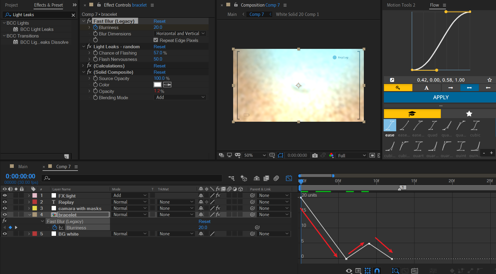

这里是对fast blur效果的模糊度进行K帧。


## 模拟相机拍摄取景框

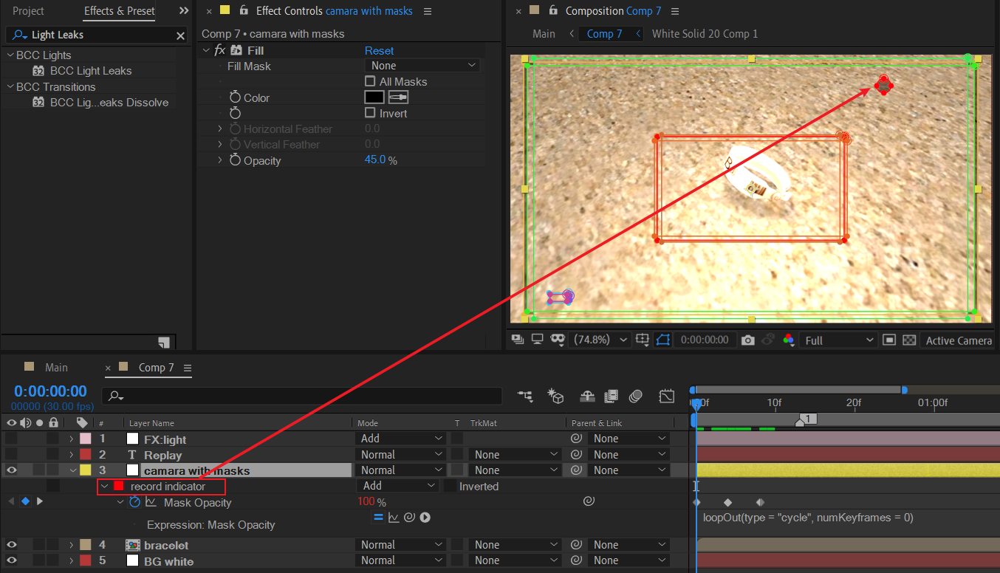

这里，使用了纯色层+mask的方式来绘制相机取景框。对于，右上角闪烁指示器，使用了loopOut进行无限循环。

个人觉得这里更好的做法是使用形状层分组进行绘制，逻辑更加清晰，也容易修改和理解。


## 打光

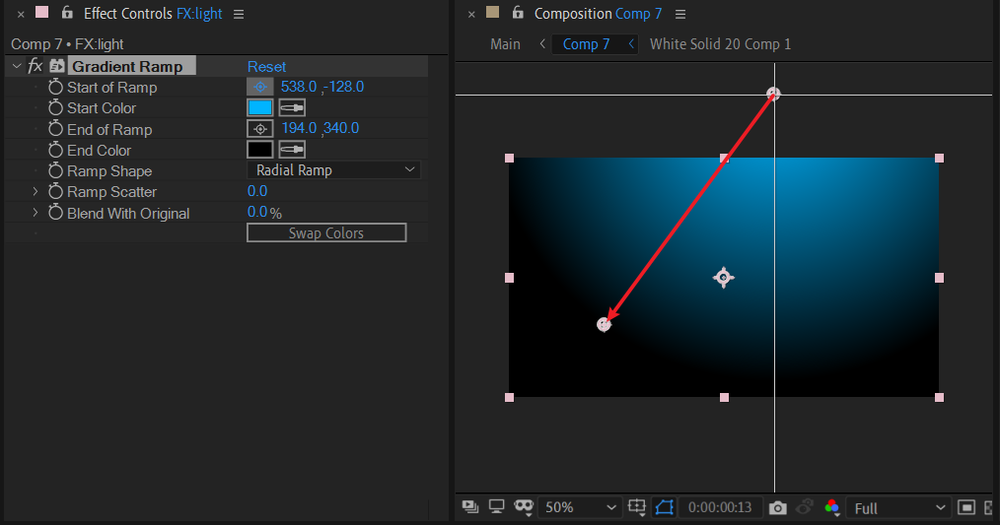

这里依旧是基本操作：纯色层+梯度渐变+叠加模式。

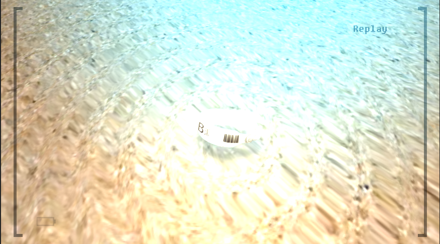

