# 06 花海与阴天

## flower-and-sky 合成内部

### 背景天空的制作

在一个尺寸很大的合成（8000x2000）中，导入一个很长的天空背景。这个合成为360度天空贴图。

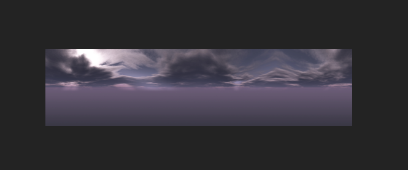

新建纯色层，命名BG-horizon。添加horizon效果。

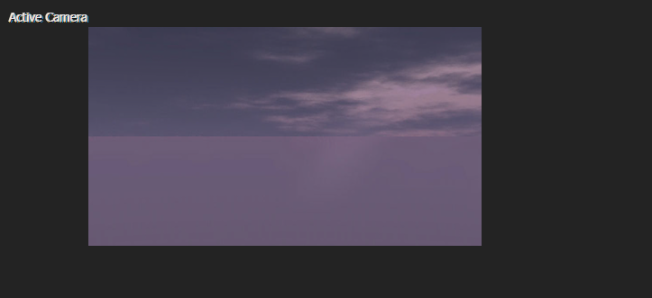

### 摄像机动画

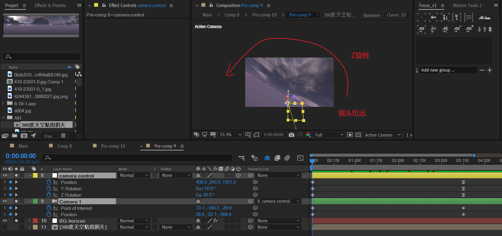

摄像机动画：Z缓慢旋转，同时拉远镜头。

结束时，视线应该是水平居中的。

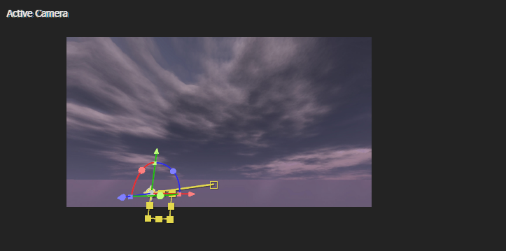

### 漫天粒子——模拟雪花

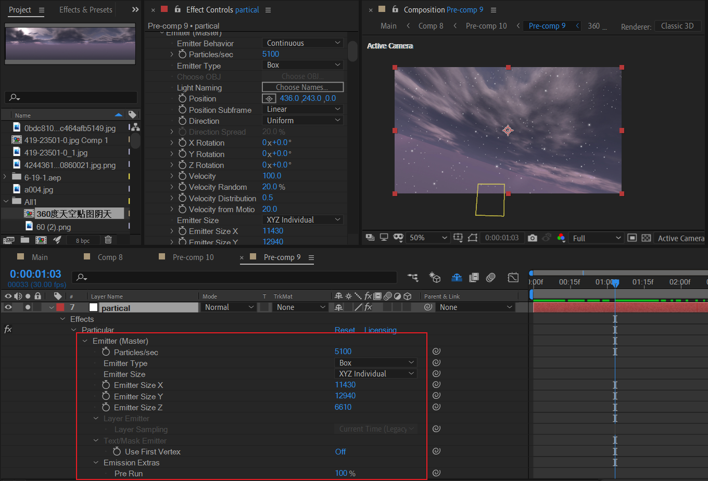

使用p粒子制作。关键点在于：

- 粒子要小而多，粒子空间很大。
- 粒子随机移动，移动速度很慢。

### 花海flowers

这里作者使用原生实现：

- 手动堆叠花朵，预合成；
- 复制多个预合成副本，调整空间位置。

#### 花朵预合成=花朵图层 x N

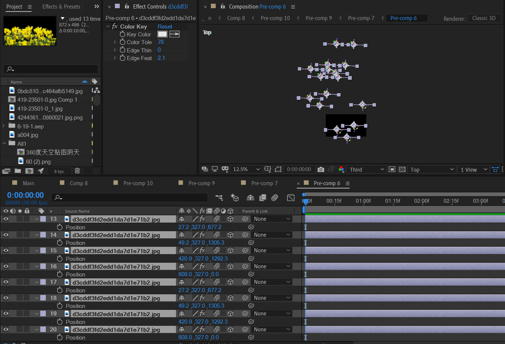

导入图片后，复制多个副本，手动调节每个图层的Z空间位置，摆放出Z轴前后关系。

> 这里，可以考虑使用AE表达式快速随机化position的每个轴位置。

#### 花海=花朵预合成 x N

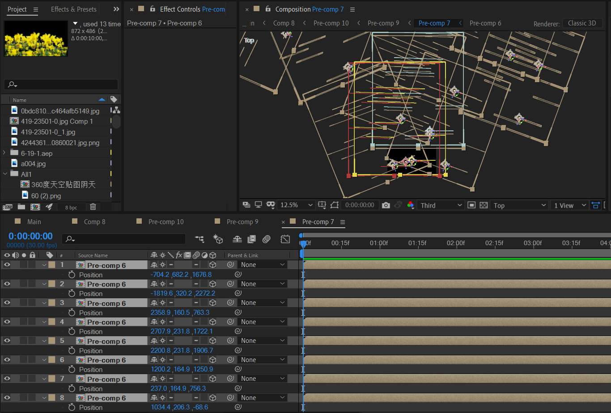

同样，这里也需要随机化每个花朵预合成的空间位置。可以考虑利用AE表达式迅速生成，从而保护创作者的生命。

#### 调色处理

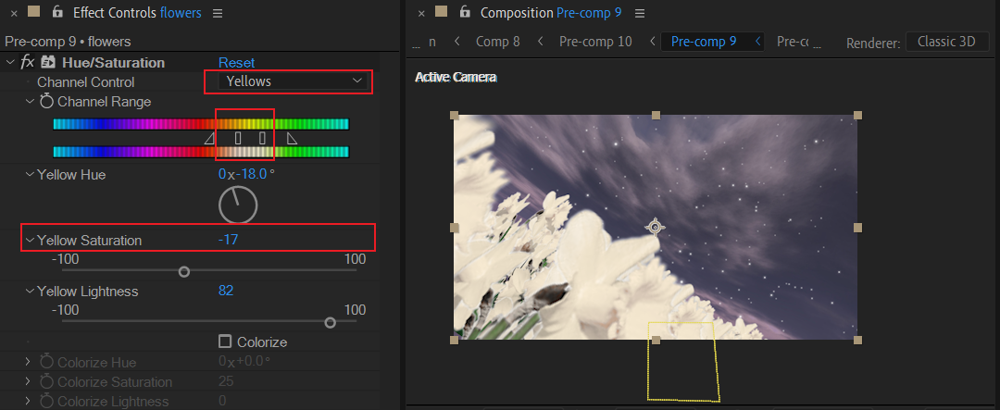

素材是黄色的花朵，因此这里选择yellows通道范围，将其修改为浅黄色。同时降低饱和度。

#### 其他制作思路

可以直接使用particular或者form模拟花海，会更加方便一点。

### 整体调色滤镜

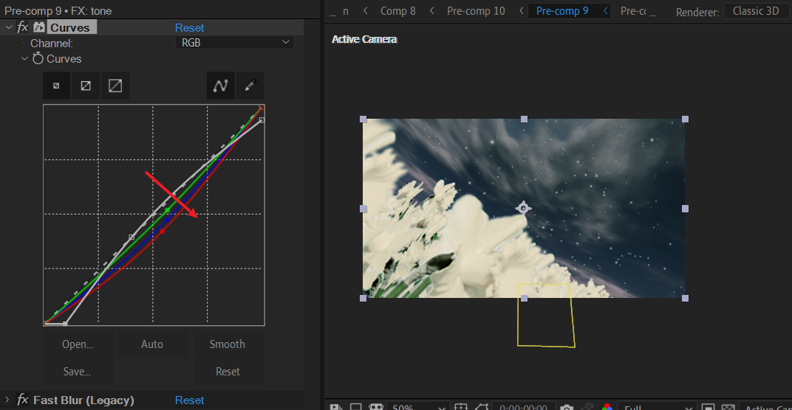

这里将RGB分量的三条线都做了修改，都是往右下角拖动轻微距离。由于绿色拖动幅度很小，因此画面偏暗绿。

达到了阴天的画面效果。

## 进一步合成

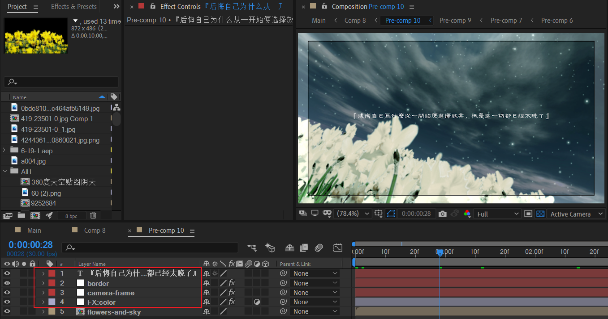

添加了相框，白色边框，文案。

## P6内部

### 场景切换

一开始的场景

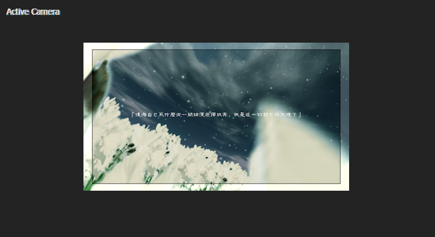

在合适的时刻打断第一个场景的合成，然后切换到第二个场景。第二个场景主题是背景图片。

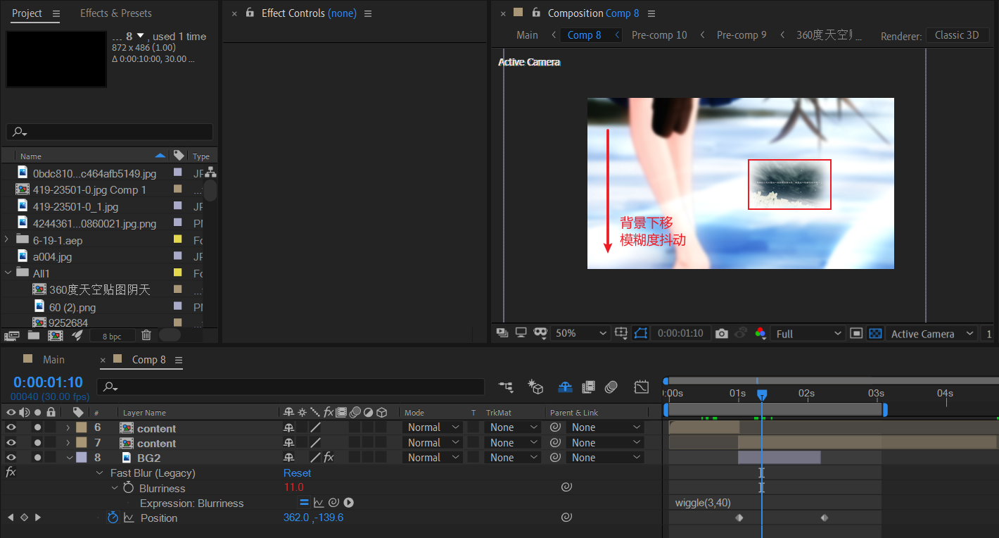

### 放大的文字圈

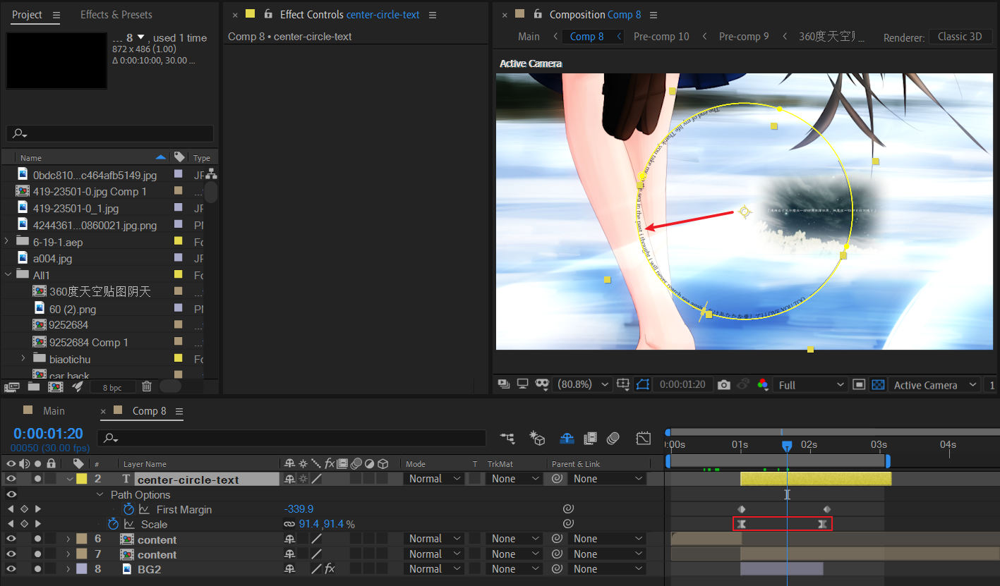

创建文字层，在这个文字图层绘制一个标准的几何圆mask，然后设置文字路径为这个mask 1。

对文字图层的scale属性K帧，进行缓动放大。

### 人物特写(close u)

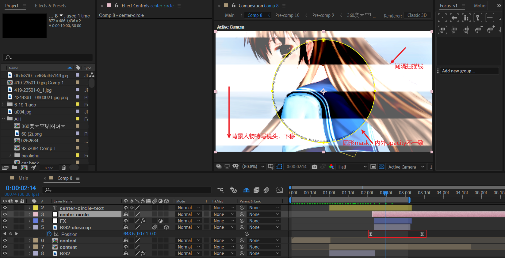

### 渐变打光

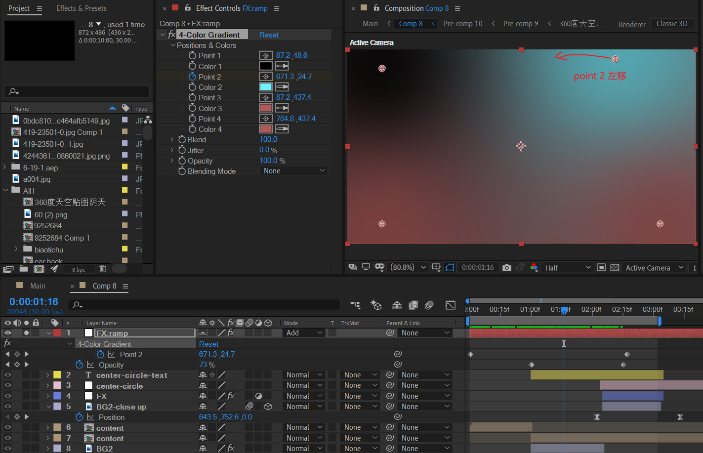

- 顶层创建一个调节层，添加四色渐变。分别设置四个点的颜色。设置图层模式为Add。
- 对右侧点进行位置K帧：左移。

关闭独显后，可以看到这个打光效果。整体上还是很亮的。

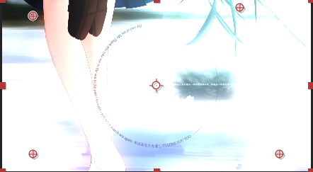

