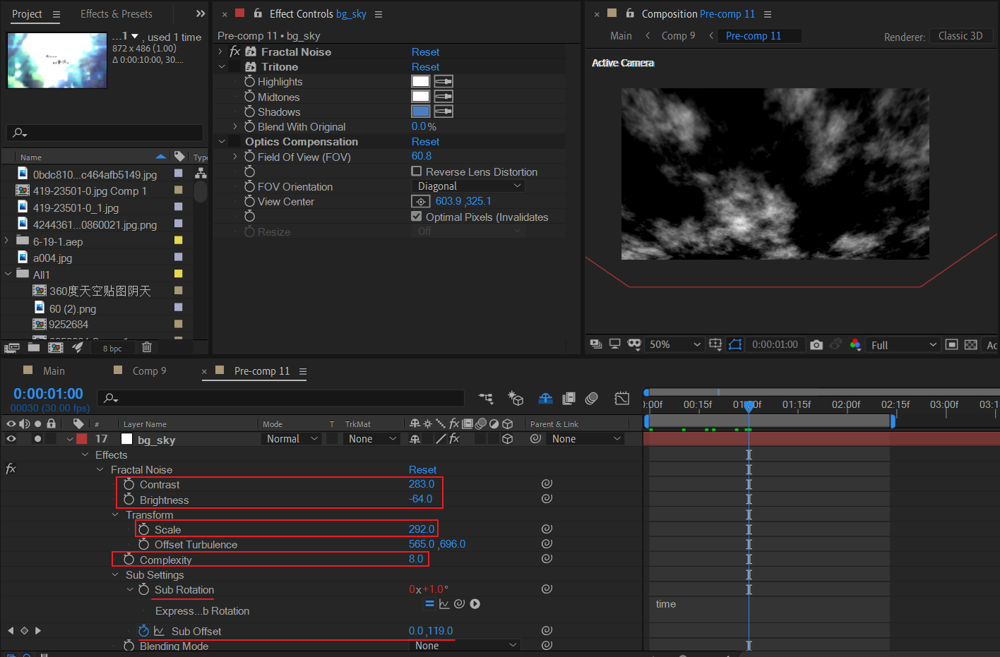
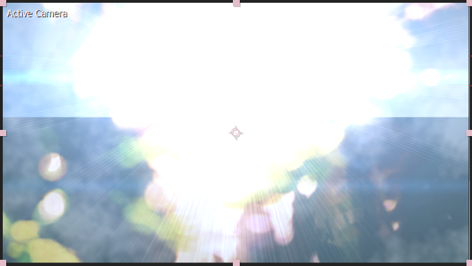

# 07 天空流云

## main_content 合成

### 基本图层——天空流云

新建纯色层，添加分形杂色。

- 增加对比度和降低亮度。
- 适当缩放，和设置合理的complexity。理论上complexity越大，模拟云朵的精细度越高，但是会加大计算量。
- 子设置部分：对子旋转进行缓慢演化，对子偏移进行Y方向的增加K帧。

最后，对这个图层设置合理的X旋转。此时分形杂色就完成了流云主体效果的制作。

后面就是上色（采用三色调）和优化观察角度（采用光学补偿，光学补偿在这里效果不是很明显）。

### 流云细节——小流云1

复制上面的基本流云图层，将transform的scale缩小。图层模式改为Add。

### 流云细节——小流云2

复制上面的小流云1图层。主要修改transform中的width和height，造成宽高差异。呈现出水平方向的长流云效果。

---

当前流云效果整体为：

### 调节层——画面噪点

### 画面调节——模糊+半透明

这里，目的是叠加一层模糊的感觉。

### 森林背景

这里，目的是加入朦胧的森林背景，并且画面切分为上半区域偏白，下半区域正常。

为了使得中间分割线能够上下随机移动，对Z position添加wiggle表达式。

---

注意这个图层使用了湍流杂色。

> 湍流杂色，是Fractal Noise的现代高性能实现。 使用Fractal Noise代替Turbulent Noise的主要原因是，前者适合创建循环动画，因为Turbulent Noise没有“演化”控件。 Turbulent Noise需要的渲染时间较短，易于用于创建平滑动画。

下面是该图层的关键帧说明。

### LF光

两种LF光的变化。

| LF1（模拟刺眼的光芒）                                        | LF2（模拟太阳）                                              |
| ------------------------------------------------------------ | ------------------------------------------------------------ |
|  |  |

LF细节。

这里使用了wiggle表达式对亮度或光源位置进行柔和地抖动。这些细节虽然很微妙，但是有的话画面会更加饱满。

---

| LF-s1（在合成中）                                            | LF-s2（在合成中）                                            |
| ------------------------------------------------------------ | ------------------------------------------------------------ |
|  |  |

这里，究竟创建了一种怎样的场景？

- 首先，是从森林背景中仰视到刺眼的阳光；
- 然后，光芒收束到天空中的太阳。

### 文案与网格修饰

### 修正摄像机观察

创建摄像机。主要调整摄像机的Z position到良好的观察角度。

## speed_line_v 合成

分形杂色，拉高高度值，演化表达式。

## iron_pole 合成

## P7

现在，回到P7合成中。

这里关键是处理前景和背景合成的清晰度变化。

顶层再打一个LF光，加强光影效果。光源位置抖动，颜色变化，光源类型突变。