# 08 花海

## main_content 合成

### BG-cell 合成——内部制作

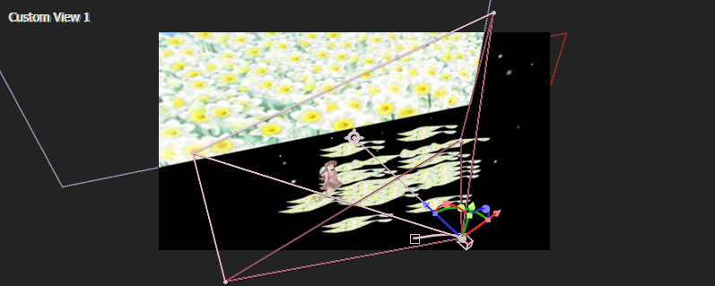

构建一个这样的场景。一个女孩站立于远景的水仙花海中。注意处理图层在Z轴的空间关系。

摄像机拍摄和人物位移。

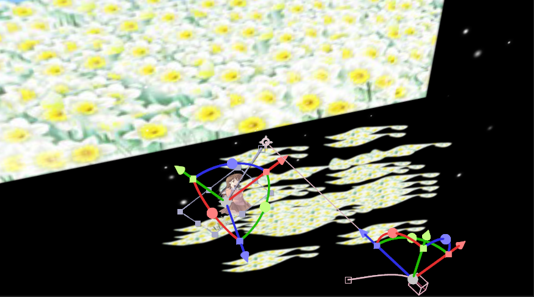

- 人物右移；
- 摄像机位置左移，摄像机目标点不动。

### BG-cell 合成——外部动画

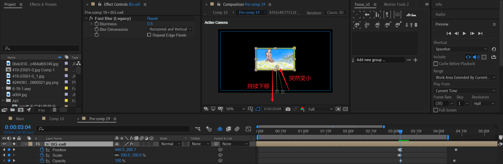

这里主要是图片背景突然变小到画面居中位置，然后Y下移，同时淡出。

### 蝴蝶扇动翅膀——内部制作

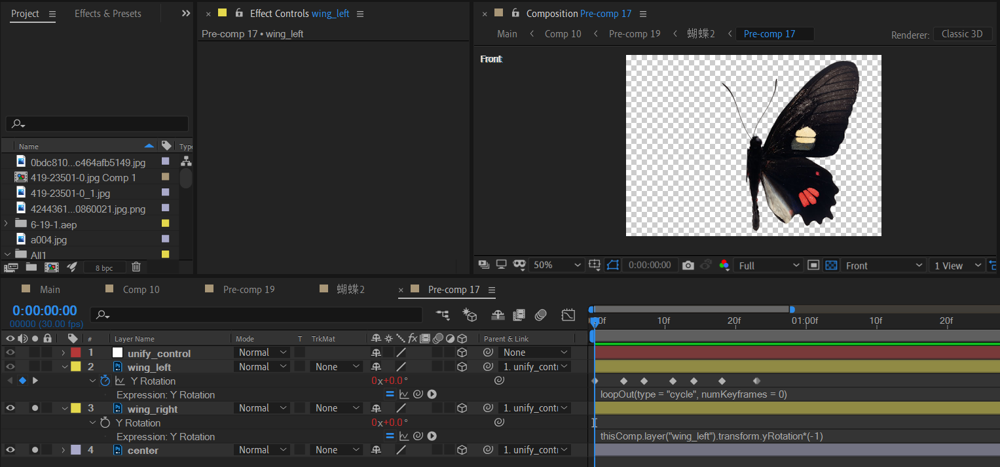

在PS中将蝴蝶中间身体、左右翅膀分层处理，一共3个图层。

- 中间身体图层维持不动。
- 主要处理左翅膀的Y旋转，然后将右翅膀的Y旋转绑定到左翅膀的Y旋转。

一个完整的翅膀扇动周期。

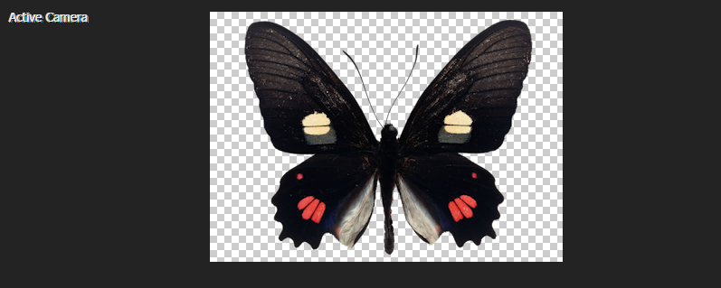

从TOP视图观察。

| 初始                                                         | 摆动角度最大的位置                                           | 恢复初始                                                     |
| ------------------------------------------------------------ | ------------------------------------------------------------ | ------------------------------------------------------------ |
|  | 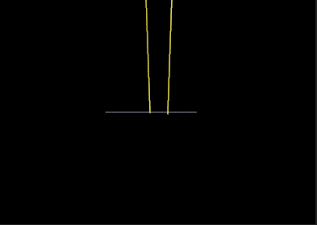 |  |

上面是一组。这里使用了三组关键帧。注意，每组关键帧的最大角度振幅不一致。例子中，分别是88,50,76。

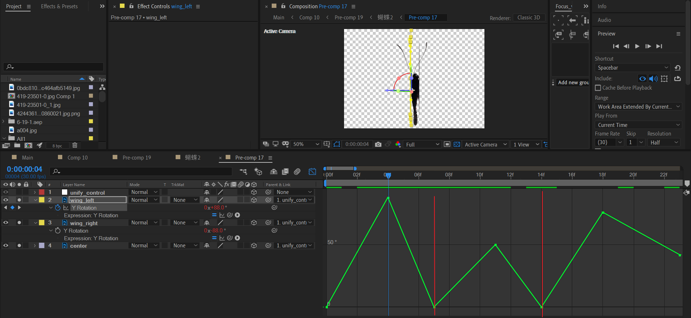

- 左翅膀使用`loopOut(type = "cycle", numKeyframes = 0)`对这三组扇动（看成一个整体）进行无限循坏。
- 右翅膀使用`thisComp.layer("wing_left").transform.yRotation*(-1)`对左翅膀的扇动进行镜像复制。

### 蝴蝶扇动翅膀——外部动画

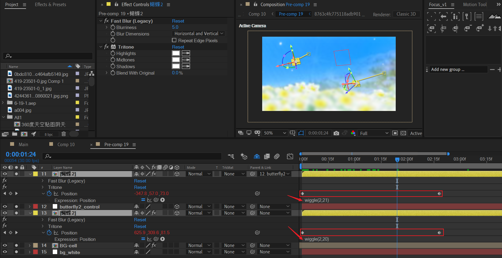

制作两个蝴蝶合成的位置动画，表示两只蝴蝶向左侧飞舞。

细节：对蝴蝶合成的position使用wiggle表达式，这样蝴蝶的移动路径就变成了曲线，显得更加自然。

> 这里，蝴蝶的位移依旧是人为设定的方向——左移。
>
> 如果想要实现**漫无方向的随机连续移动**，可以去掉位移方向的人为设定，即将位置关键帧去掉。然后思考如何随机连续化位置的变化，根据之前介绍的perilin noise，perilin noise是符合要求的。那么将time作为随机的原始种子，问题就可以解决了。

### BG-cell 迷你版的动画

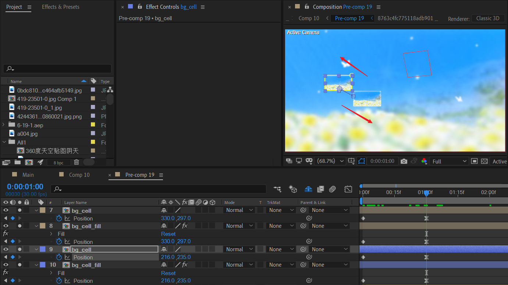

复制四个BG-cell副本，统一缩小以index 7和8作为例子讲解：

- index 7：缩小到一定比例，例如35%。
- index 8：缩小到一定比例，必须比前景大一点，例如采用35.5%。 添加fill，填充为白底。

### 十字矩形mask

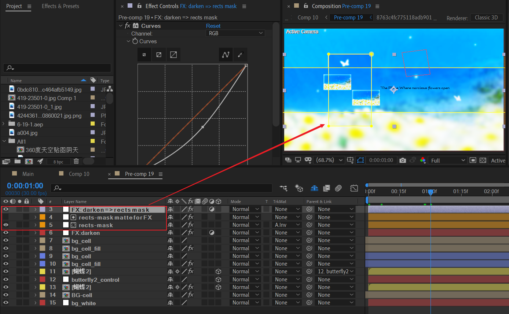

新建纯色层，绘制两个互相垂直的矩形。复制副本，分别调整内外区域的亮度，保证亮度有差异，从而产生明显的边界。

### 文案

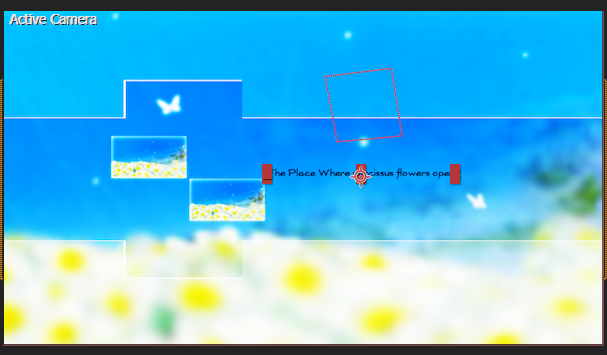

> The Place Where narcissus flowers open 水仙花盛开的地方

## P8

### 白场淡入+画面笔刷化

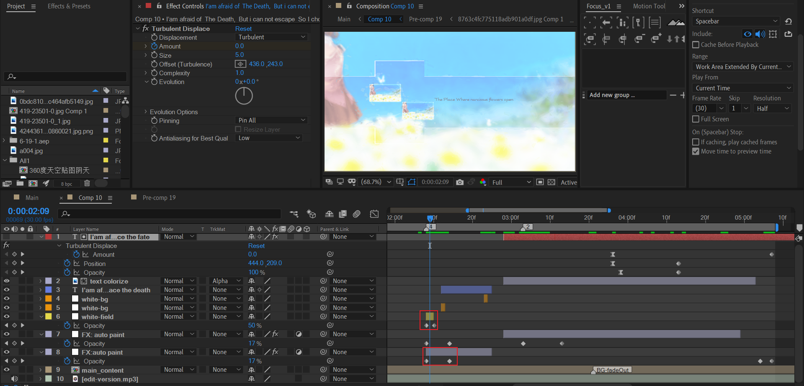

白场：使用纯色层，淡入。

画面笔刷化：使用调节层+S_AutoPaint效果，淡入。

### 两次中间白场

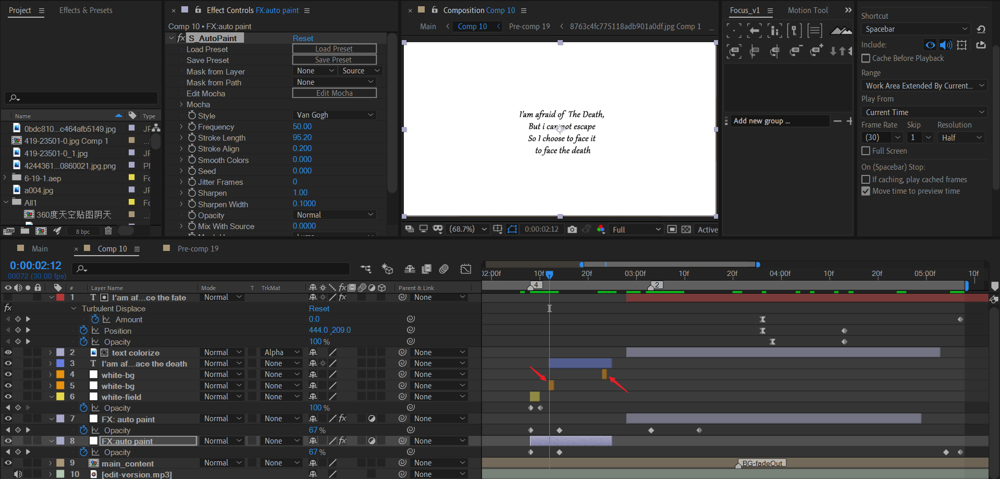

### 笔刷效果淡出

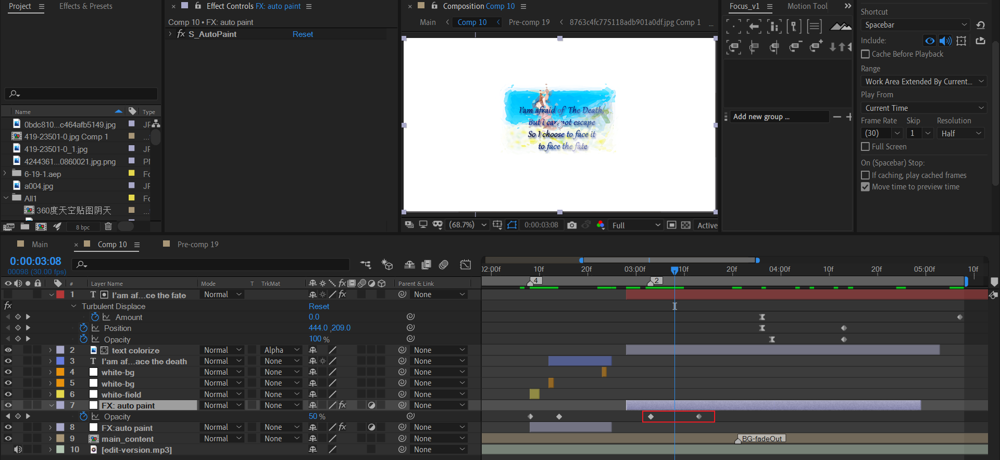

### 文字出场

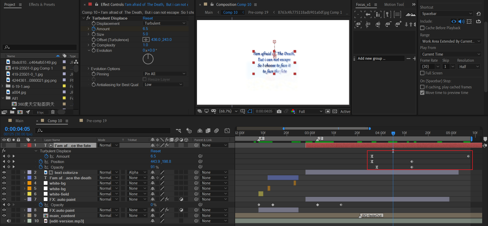

文字出场有三个动画：

- opacity淡出
- position Y上移
- 湍流置换轻微扭曲，随时间增加，扭曲程度加剧。
