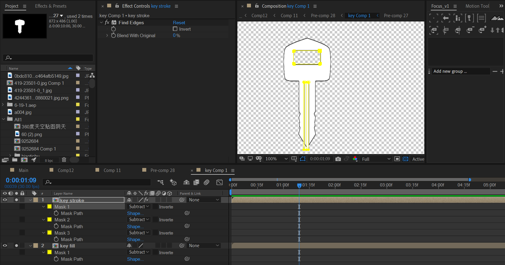
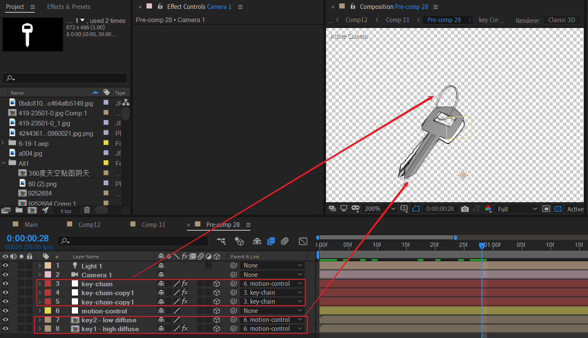
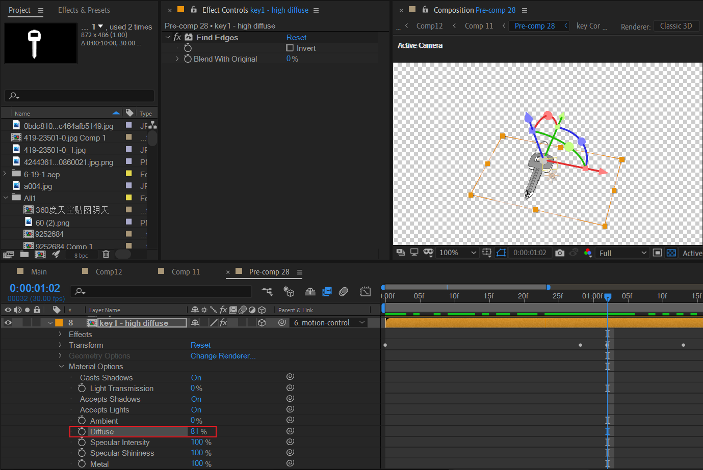
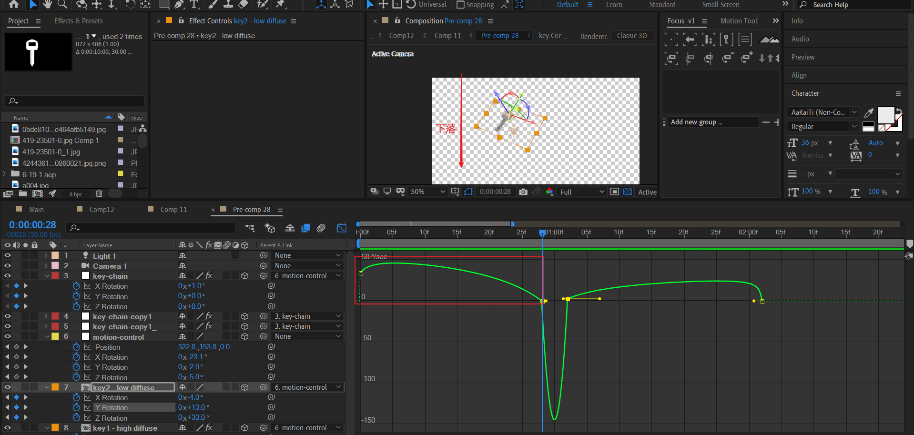
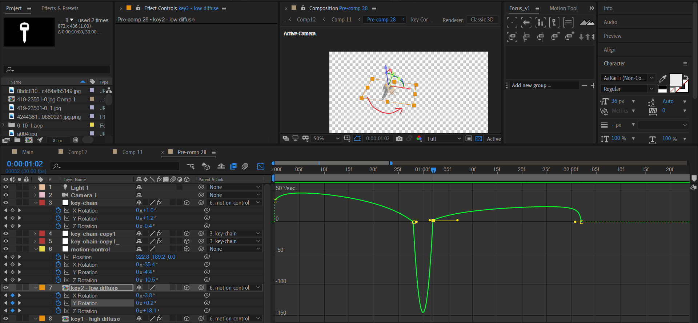
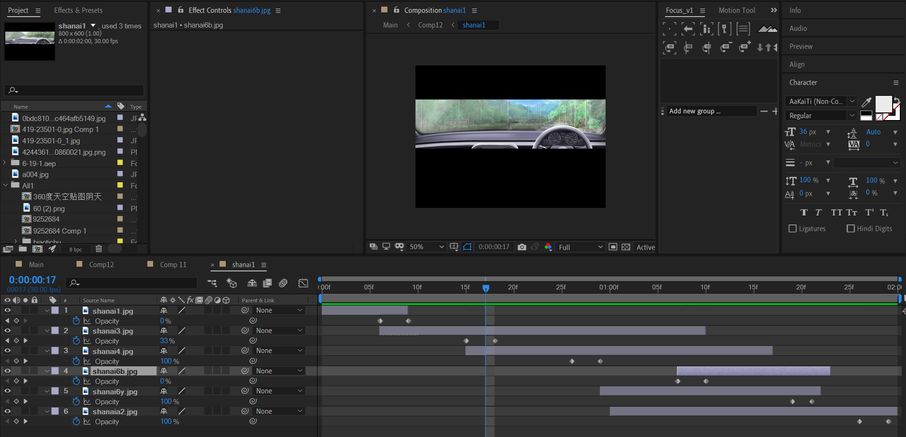
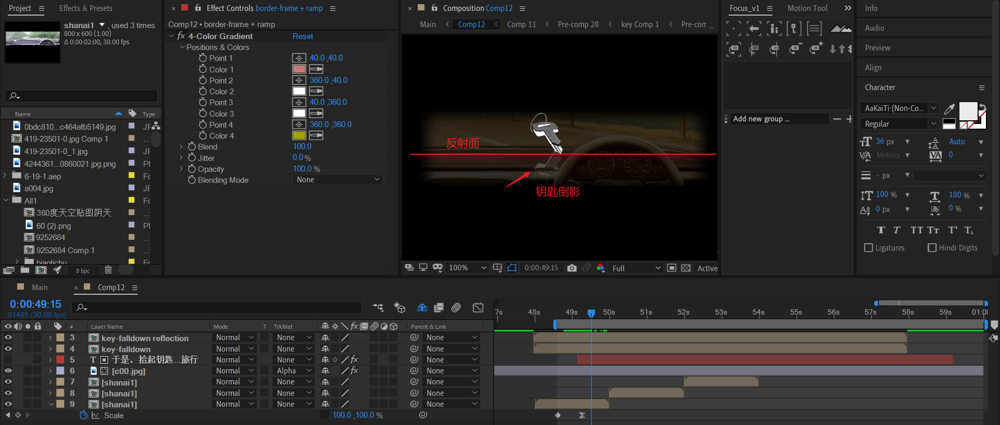
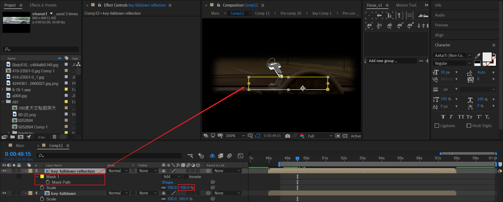
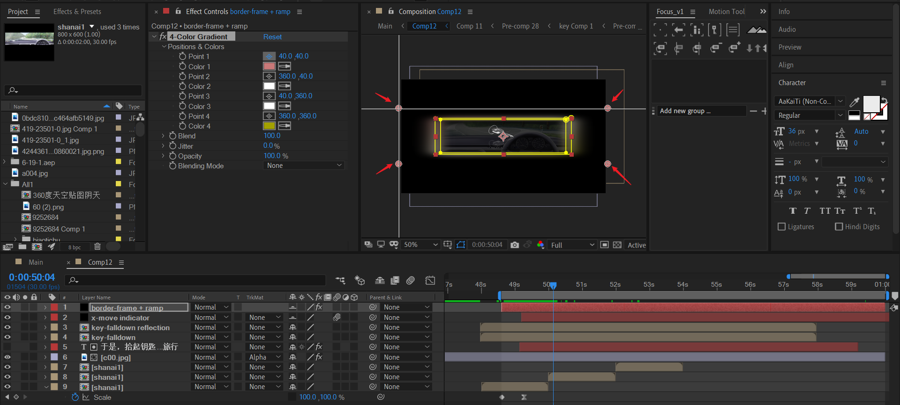
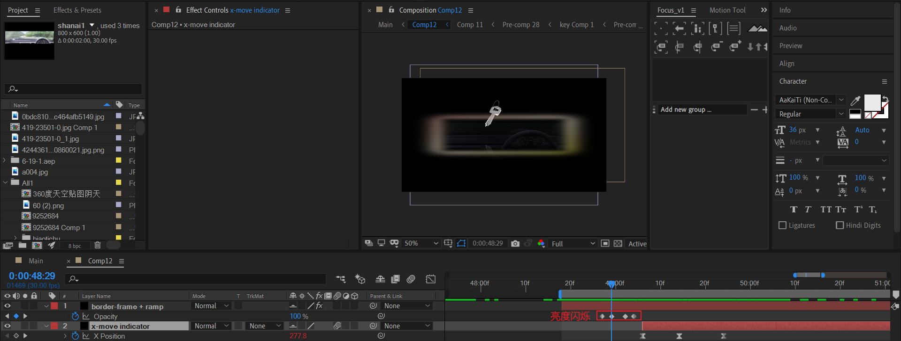

# 09 钥匙

## 钥匙掉落

### 制作钥匙

- 先制作轮廓白色填充，使用mask绘制；
- 然后制作轮廓黑色描边，使用mask+find edges效果实现。

### 制作钥匙环+画面材质

钥匙环：本质上是圆圈，这里有2个圆圈。对于圆圈的制作，下面说明：

- 纯色层绘制两个半径非常近似的圆mask，两个圆之间的间隔就是钥匙环。
- 然后调节该图层的orientation来处理透视问题。

钥匙这里有两个，其中一个灰色，一个白色。这是通过打光完成的。

（个人觉得这里打光有点不符合光学规律，正常来说：上面的钥匙应该是白色，下面的是灰色阴影的才对。）

关键是材质中的Diffuse属性，这个是漫射的物理含义。值越大，代表漫射越强，材质越白。

### 钥匙整体的下落动画

第一步：垂直下落。

第二步：主体Y旋转。

第三步：继续Y旋转。

这里主要模拟下落以及碰到平面时的运动。关键帧请可能参考物理学规律。

## 背景多图片替换

这里是通过导入多张图片，然后进行叠化淡入淡出。

## P9

### 钥匙倒影

为了限制反射区域，采用mask来绘制倒影区域。反射主要通过钥匙副本图层+Y轴取反实现。

### 视口边框

- 绘制mask +mask羽化。
- 添加四色渐变。

视口边框需要闪烁出现。

