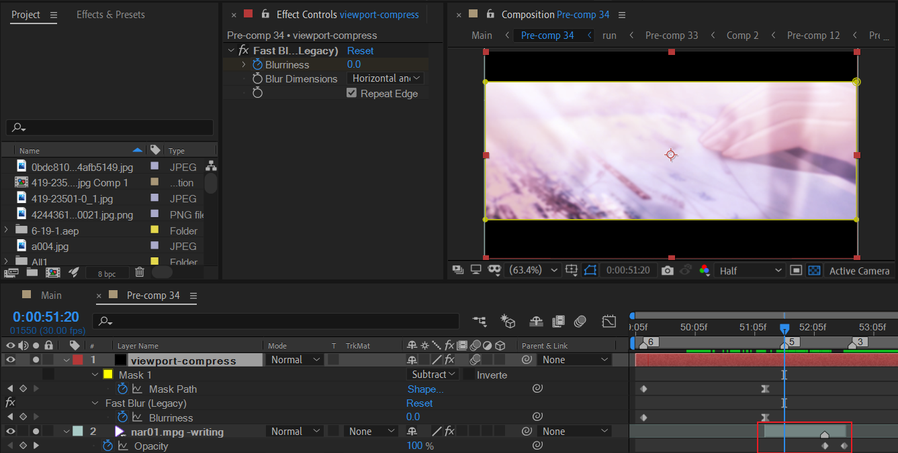
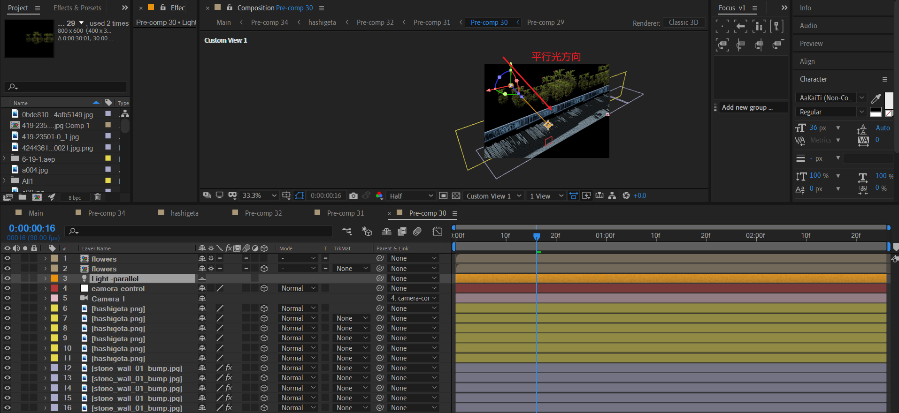

# 10 时光流逝

## 建立视口——压黑边

在压黑边的同时，使用模糊处理内黑边边缘进行淡入。

## 视频片段1——书写与树木阴影

视频片段来自水仙1游戏的OP。这里树木阴影和书写主要表现的是时光流逝的感觉。

## car lens——行驶的车与后视镜

这段素材是人工实现。关键在于三点：

- 行驶的车。

- 车窗外，景物后退。

- 车外后视镜中，景物反方向后退，景物缩小，视野比较广（物理学的凸镜是缩小反射影像）。

  > 理论上，应该是缩小的影像，原作中，似乎是制作了略微放大的影像。这点需要读者注意。

### 整体实现的分析

我们先看下实现结果的图层逻辑：

按照上面的分析，如果忽略掉打光，那么只需要重点关注3个图层：

- index 4：后视镜。
- index 6：道路合成副本，反方向后退。通过添加时间重映射——反转来实现反方向。
- index 7：道路合成副本，后退。

其中，后视镜是通过mask来简单抠图，使用色相饱和度来处理饱和度降低。

### 道路合成

现在，重点来关注道路合成。

背景有一个天空合成，道路合成继续被包装成预合成。

这里对道路合成添加了细节：曲线调色和方向模糊。其中方向模糊比较重要，因为在行驶的车上，看到的窗外景色是存在方向模糊的。**个人认为方向模糊的方向应该和道路后退的方向保持大约一致。**

我们继续深入道路合成road内部来探究实现细节。

---

桥上风景的搭建。

我们先来看下要实现的目标效果。

这里需要有道路，栏杆，花朵盆栽。其中：

- 栏杆和道路成90度角。
- 花朵盆栽位于栏杆后面。

下面开始说明实现。

这里，采用了最为原始的图层副本的方式来进行铺路，重复栏杆，和制作花朵盆栽副本。

---

然后，创建摄像机并绑定空对象。

对空对象的X位置K帧，实现摄像机位置前进，因此道路后退。

---

这里，新建一个强度足够的平行光，目的是为了产生花朵和栏杆的投影在道路表面上。

下面是左视图，注意各个景物的位置。

## tree and sky——树木与天空

这是一个不断推进的镜头，两侧树木后退，天空云朵也在后退。其中：

- 云朵使用分形杂色实现。
- 两侧树木后退使用3Ds MAX来制作，导出的是TGA序列。

### 天空

这里，不再细讲云朵合成内部的制作。此外，需要注意的细节：使用边角定位和光学补偿来完善仰望天空时的视角。

需要提醒的是，云朵的流动是依据Z position的演化来实现。

### 两侧树木

使用3ds max将max工程文件渲染69-500帧范围，得到TGA格式的序列。注意渲染时选择RGB+alpha通道。

### 打光

上面的场景做好后，就是打光环节。这里在两侧打光，打光使用LF光插件或者简单的梯度渐变。

## img-fast show——图片高速淡入淡出

选择一个图片图层进行分析：

- position向右下角位移；
- 末尾淡出

按一定延迟叠加这种制作模式，形成图片画廊的快速入场和出场。这里使用了20张图片。

## 视频片段2——海滩与女孩（慢放特写）

这里，使用了水仙1游戏OP的另一段视频作为镜头。图中红色线框部分在合作中是>2s的时间，而在原视频中是0.5s左右。

使用了时间重映射来实现特写慢放。这个场景我认为是这个MAD的神来之笔，因此此时刚好配合音乐BGM，将情感渲染地非常自然。

此外，使用LF打光，打亮右侧人物区域。

## 文案

> “因为我从一开始就明白，一切都是不可能实现的……”

这里，使用了现在看来已经过时的效果【Path Text】。对字符间隔进行K帧：先是增加字符间距，然后缩小字符间距到负数（重叠）。

需要留意的是，这里继续添加了模糊效果，并对模糊入场和出场进行了定义。

入场和出场时的模糊值都是较大的正数，中间一定时间范围内，模糊度保持0。

