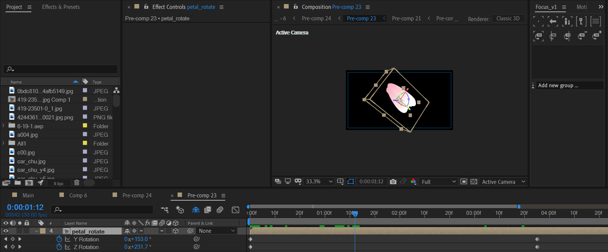

# 11 飞舞的花瓣

## main_content

### 花瓣自旋转+飞出

花瓣自旋转。

里面的花瓣是采用纯色层+mask+渐变手动绘制的。工作量比较大。可以考虑使用花瓣素材来加速制作，效果不会相差太大。

---

摄像机动画。在自定义视角观察分析。

首先，是镜头推近。

然后，是镜头往后拉远，然后稍微往左移动。

此时，对应活动摄像机视角。

### 天空

使用天空素材贴图+horizon插件制作。

### 小花瓣风吹效果

这个效果使用CC Particle World效果来制作。

此外，使用三色调来对花瓣粒子进行着色；使用快速模糊来模糊；使用glow来发光。

### 很弱的光晕——OF光

### 摄像机动画

从TOP试图观察，注意位置和目标点的关键帧。

- 目标点：往右下角轻微移动。
- 位置：先往右侧移动，然后往上，最后往下。

## P11

将main_content放入P11后，需要进行时间重映射。

前大部分是慢放，后面是快放。

---

然后只需要完成3步。

1. 新建纯色层，对opacity进行wiggle，制作画面闪烁效果。
2. 新建调节层，使用曲线调色。
3. 新建纯色层，传统压黑边。

需要留意的是，这里调节层将整体画面染成很鲜艳的红色。

到外层合成中，使用三色调重新将中间调修改为淡紫色。

## 复制P6中的花海和天空场景

> 直接拖入的复制方式是引用式复制，修改合成副本会引起原合成的修改。如果需要分离式复制，使用Ctrl+D进行独立复制。

复制一份P6 合成中flowers-and-sky的合成引用，放于P11上方，然后使用Add图层模式。

## 文案

