# 12 时钟与生命倒计时

## gears

### 齿轮圆形填充

首先，制作一个这样的背景。

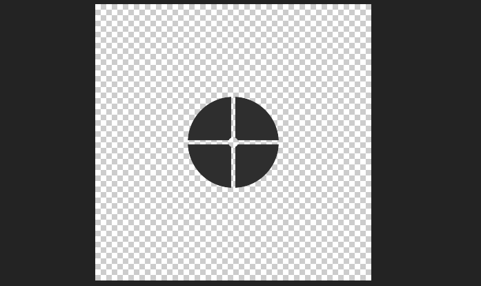

可以通过纯色层/形状层+mask来实现。


### 外围锯齿

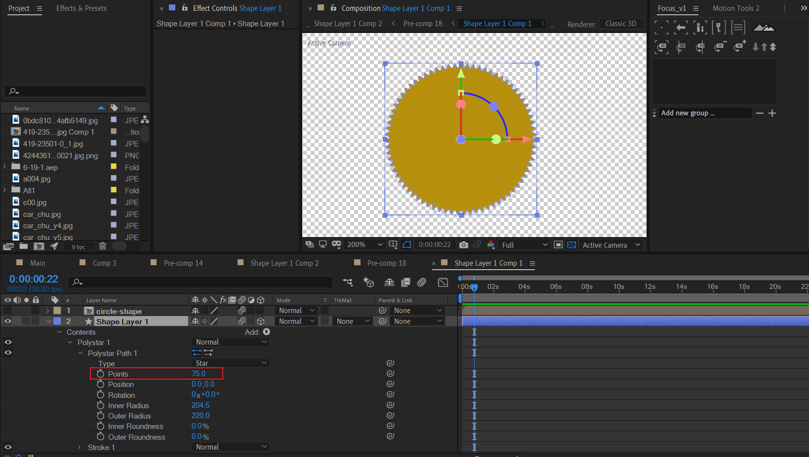

形状层，添加星形，设置较大的点数，图中是75。

对这个锯齿图层设置alpha反转遮罩，可以得到一个独立的齿轮合成。

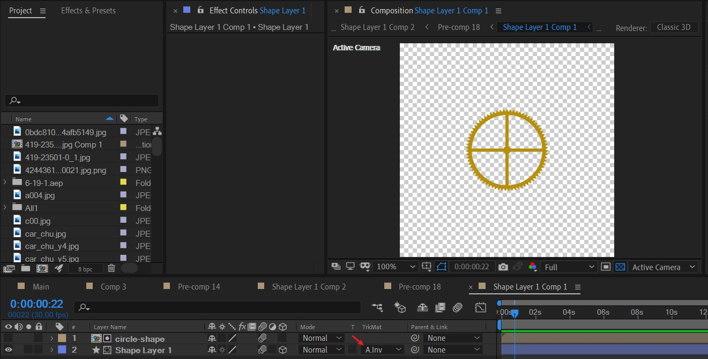


### 不断旋转的齿轮

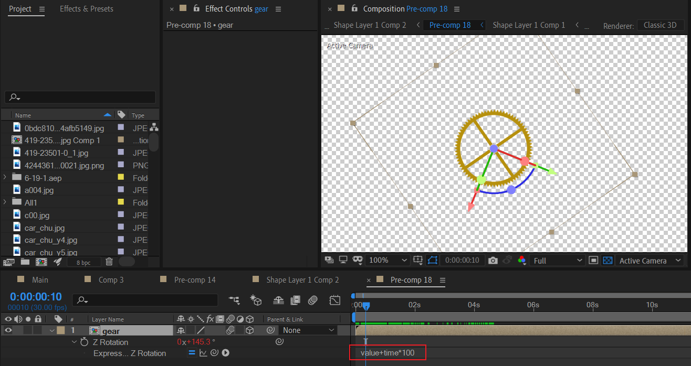


### 齿轮组

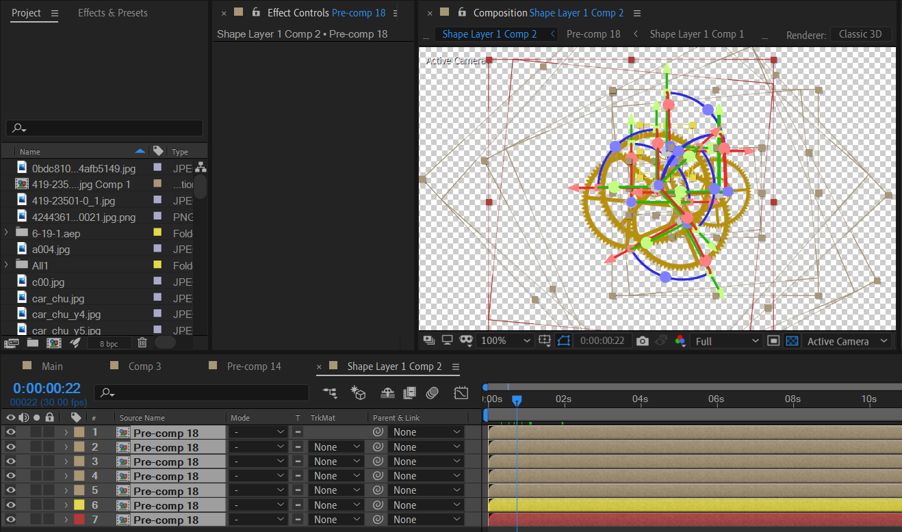

复制多个齿轮副本，随机差异化scale尺寸、position位置、初始的Z旋转角度。


## mini-clock

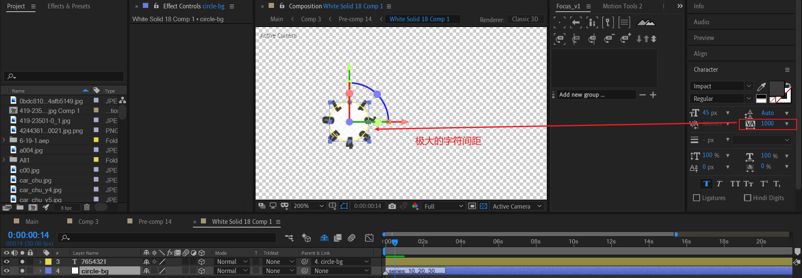

- 一个纯色层+圆形mask作为白色底
- 文本输入 7-1的每个字母，增大字号大小，打开伪粗体，设置一个极大的字符间距。

此时，文本的数字已经比较黑了。下面我们来进行这一步——越描越黑。


### “越描越黑”

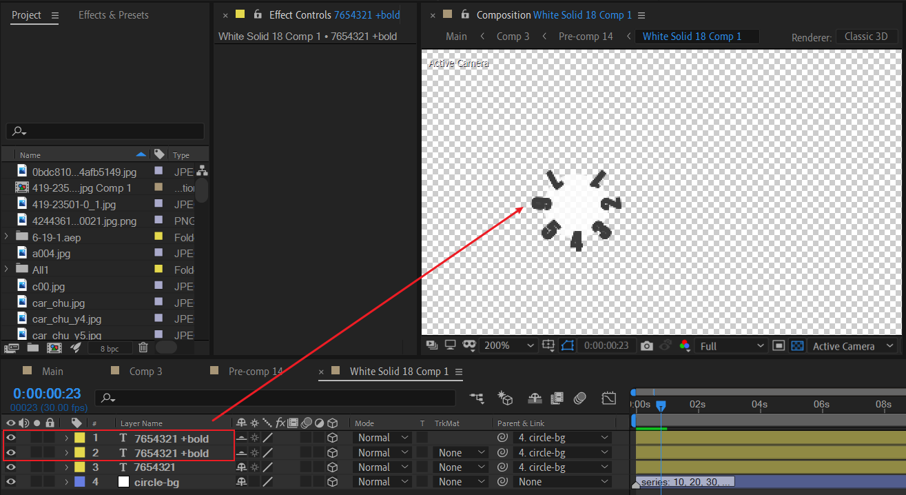

复制两个数字文本的图层副本，置于顶层。此时可以看到数字文本已经显得较粗黑。

这里，使用了复制多个图层副本的方式来加深文本的显示效果。虽然，越描越黑这个词的引申意义并不是这样。

> “越描越黑”的意思是：那些不好的丑事，如果发生了，暴露了，不解释还罢了，越解释越令人关注，越解释越难看、越难听，把原本人们不知道的事，也都公诸于天下了。


### 间隔时间地转动

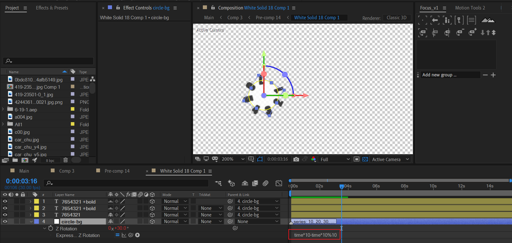

将所有数字文本父链接到这个父对象：圆形白色背景。然后在这个父对象的Z旋转属性建立表达式:

```js
time*10 - time*10%10
```

这行代码会生成 0，10， 20，30，......的值序列。

代码解析：

- `time*10%10` 仅在 time为整数时，例如0，10， 20，30，......时才会为0。此时`time*10 - time*10%10`的结果就是`time*10`的值， 也就是0，10， 20，30，......的值序列。
- `time*10%10`在time不为整数时，例如 time = 2.3，此时`time*10%10`的结果为 23%10=3。`time*10 - time*10%10`的结果为23-3=20。更严谨地，在time位于[20,30）时，`time*10 - time*10%10`的值为20。

所以，上面的这行代码本质上就是在去掉一个数的个位，保留十位以及十位以上的数字。


## clock-surface

使用纯色层绘制钟的表面。

| 1                                                            | 2                                                            | 3                                                            |
| ------------------------------------------------------------ | ------------------------------------------------------------ | ------------------------------------------------------------ |
| 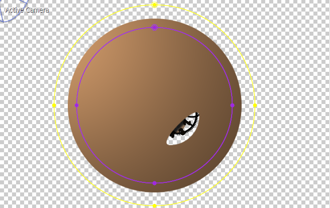 | 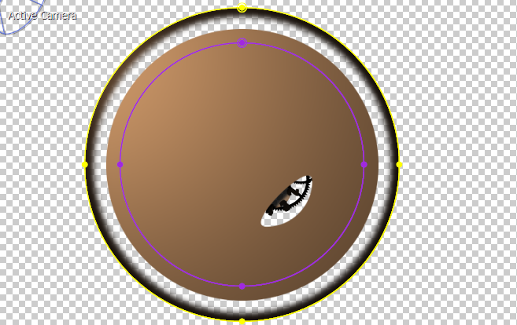 |  |

这里，关键在于使用圆形mask，合理设置羽化值，避免边缘过于僵硬。


## clock-shadows

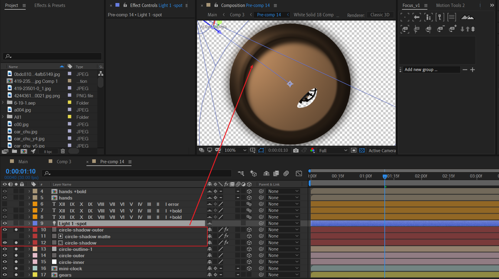


## 打光

使用聚光灯类型打一个顶光。


## clock scale ——刻度

罗马刻度钟的示例图：

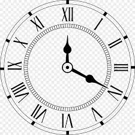

罗马刻度的文本：

> ⅩⅡ    ⅩⅠ    Ⅹ    Ⅸ    Ⅷ    Ⅶ    Ⅵ    Ⅴ    Ⅳ    Ⅲ    Ⅱ     Ⅰ

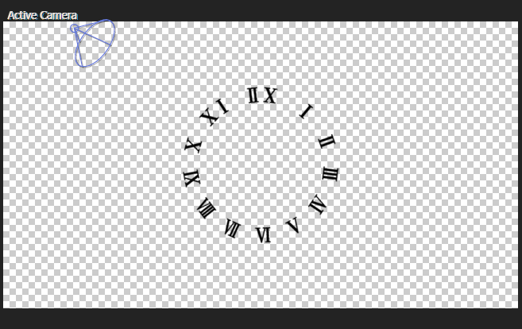

这个刻度的雕刻方向和上面的示例图不是完全一致的。

使用越描越黑的做法，将这个刻度加粗加黑。

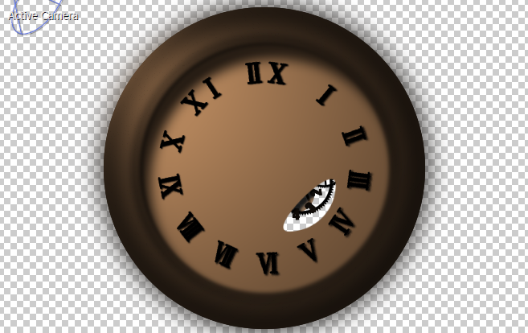


## clock hands —— 刻度针

### 一个刻度针

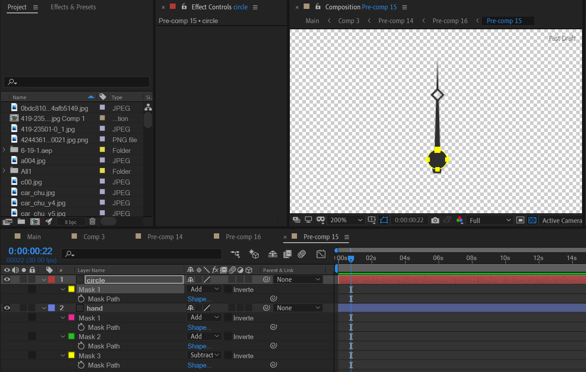


### 三个刻度针

梅开三弄之后，得到三个指针。

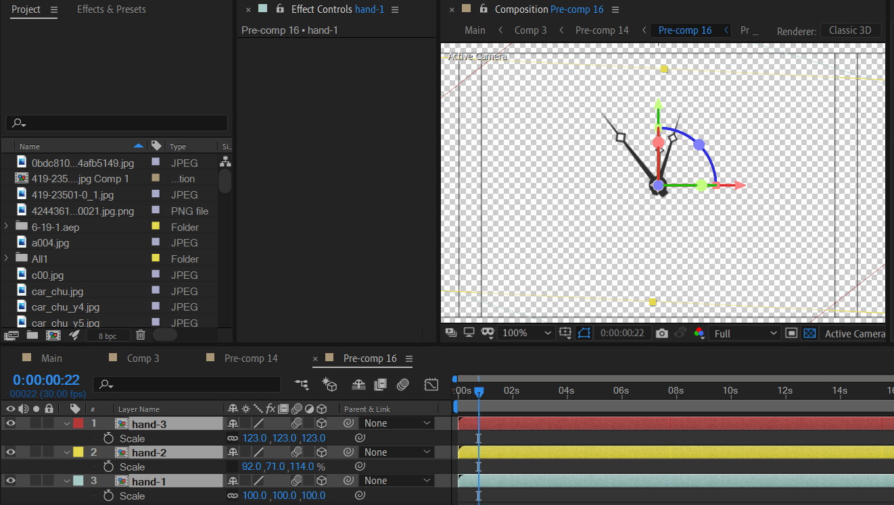

这里，修改各自的scale大小。


### 严谨的指针旋转逻辑——时间流逝

我们先来计算一下。

- 秒针：每60秒走一圈，速度为360°/60s=6°/s，所以秒针一秒走了6°。
- 分针：每60分钟走一圈，速度为360°/60min=360°/3600s=0.1°/s，所以分针一秒走了0.1°。
- 时针：每60分钟，时针走30度，速度为30°/60min=30°/3600s=1/120 °/s≈0.0083°/s，所以时针一秒大约走了0.0083°。

**结论：每经过1秒，秒针走6度，分针走1/10度，时针走1/120度。**

**现在，我们需要计算：每经过1/6秒，秒针走1度时，分针和时针究竟走了多少度？**

> 即使事实上秒针绝对不会走1度，因为秒针最小走6度。但是，为了获取换算关系，有必要进行这样的假设。

明显地，同除以6，可以得到每经过1/6秒：**秒针走1度时，分针走了1/60度，时针走了1/720度。**

---

因此，可以给出以下实现。

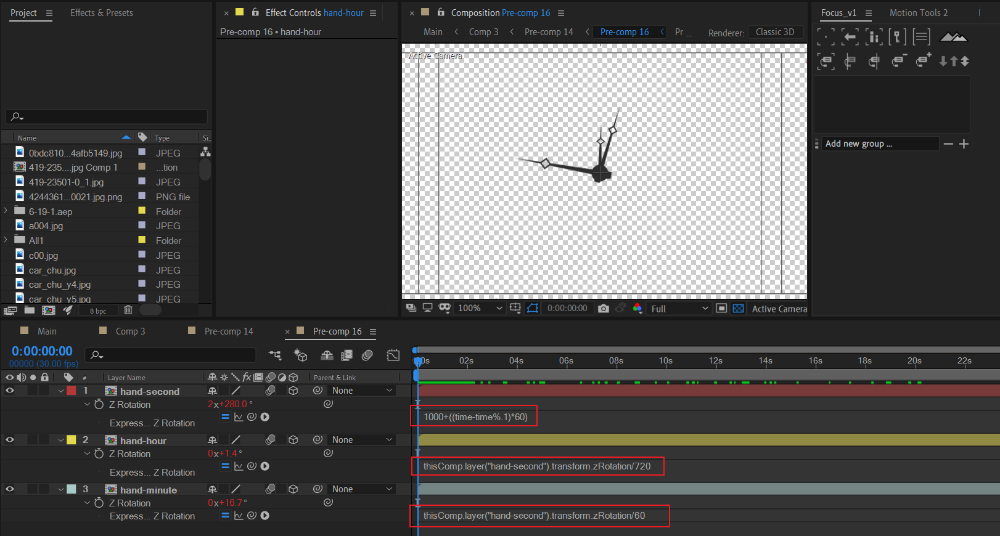

对于秒针的Z旋转的表达式。

- `time-time%.1` 表示去掉time的0.01精度及以后的精度，也就是只保留一个有效小数位。因此会生成这样的序列：0.1,0.2,0.3,...。
- `(time-time%.1)*60` 表示生成这样的序列：6,12,18，...。
- `1000+((time-time%.1)*60)`表示初始偏移量为1000，然后不断增加6,12,18，...。

需要注意的是，这里，每3帧（按帧率30frame/s计算，3帧是0.1秒），也即是每经过0.1秒，秒针走6度。

因此，在这里，时间被加速了10倍。

分针：

```js
thisComp.layer("hand-second").transform.zRotation/60
```

时针：

```js
thisComp.layer("hand-second").transform.zRotation/720
```


### 越描越黑

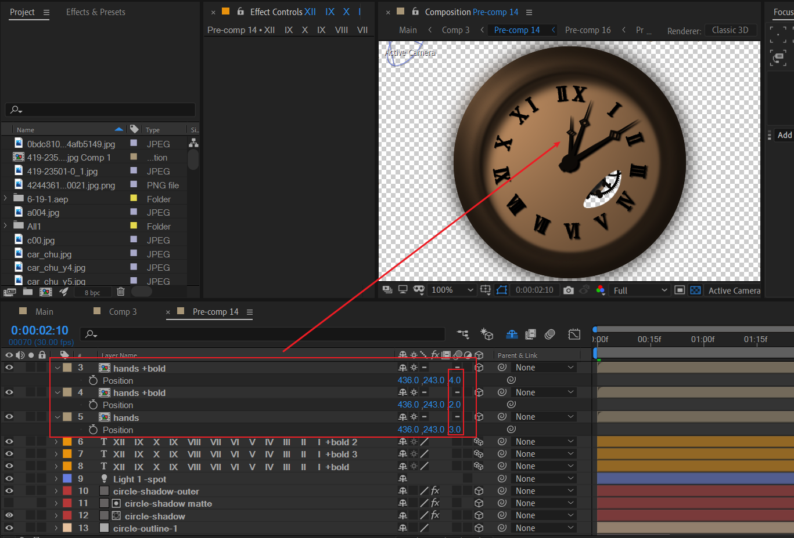


## 摄像机动画

开始视角

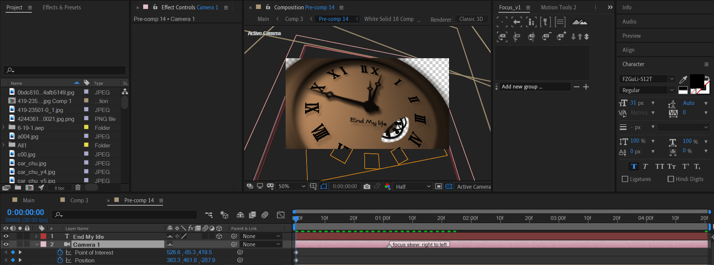

结束视角

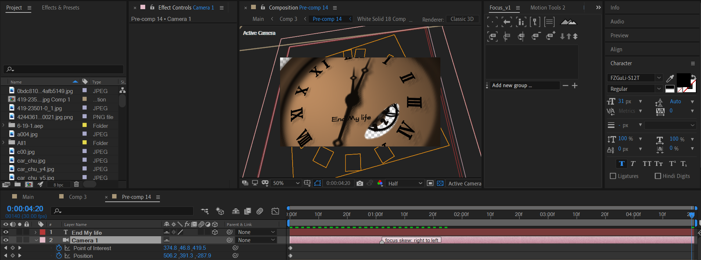

通过TOP视图，可以很直观地观察。

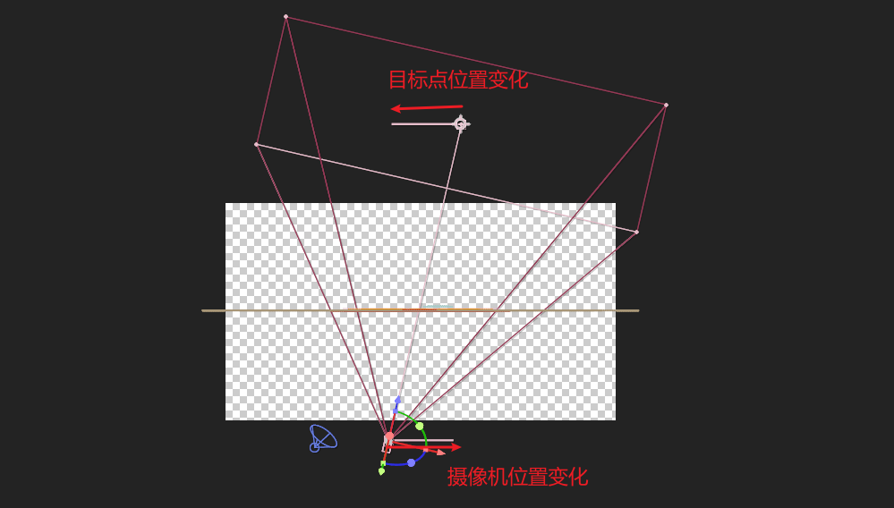


## 整体打光

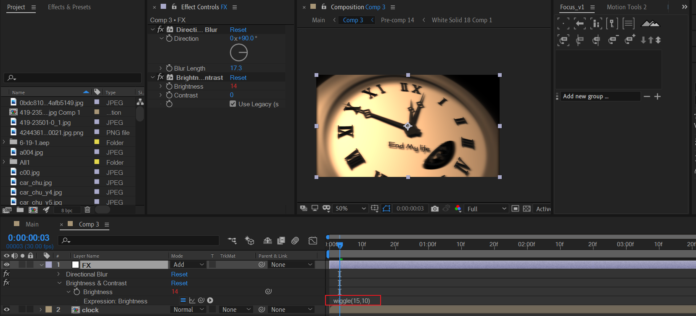

使用亮度/对比度进行调节明暗，然后表达式抖动亮度。

