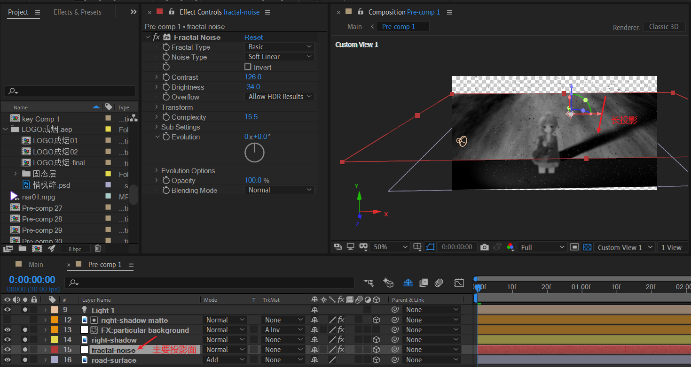

# 13 雪景

## 道路表面

导入道路图片。旋转X方向到正常的路面角度。注意设置为Add模式。

添加分型杂色层。放于道路图层下面。注意图层Y轴的上下关系。

## 人物

将人物素材（长门有希）导入。

现在，需要制作场景中的粒子。模拟下雪效果。

注意这里打开了shading设置，因此需要创建一个光源来进行打光。

### 光源

这里使用了聚光灯，聚焦于人物区域。

### 人物影子

现在，我们来仔细地制作人物在地板上地影子。

**此时，注意将人物图层的接受灯光和产生阴影打开，同时注意打开主要投影面（这里是分形杂色层）的接受投影的开关。**

原作中，作者不仅使用了灯光自然产生的人物投影，还手动制作了一层人物投影。

这个步骤可以省略，个人觉得自然光源产生的投影比较真实。

## 其他细节

- 远景填充
- 前景粒子

## 画面整体打光——渐变

## 摄像机动画

### 初始拍摄角度

关键点在于，摄像机位置的Y轴比人物的Y轴高，目标点位于地板上。

活动摄像机效果：

### 关键帧

上图是LEFT和TOP的辅助观察视角，标注了摄像机位置的移动，目标点保持不动。

本质上，这是一个锁定目标点，然后缓缓拉远的镜头，这里的远处指的是后上方。

好了，到了这里，还差最后一个关键的细节。**这个细节就是地面的积雪效果**。

之前制作了背景的下雪效果，但是雪花掉落到地面时，是穿过地面的。现在，我们需要模拟自然环境，把雪堆积在地面。

## 积雪

> 参阅：[Trapcode Particular 3 Training | 08: Physics: Bounce](https://youtu.be/RuUJqSDJFIg)

我们来看下之前的雪花穿透地面的情况。

下面，我们创建一个聚光灯类型的光源，并将这个光源父链接到前面的分形杂色层（主要的投影层，同时也是主要的地面积雪层）。

同时，对背景的下雪粒子层，设置物理模拟参数。

首先设置bounce类型，然后设置重力，这样雪花就会往下掉落。

然后，设置地板图层为 15.分形杂色层。 Wall Layer不需要设置，因为这里没有使用到。

碰撞事件类型设置为Stick，表示雪花碰到地面就静止。这就是积雪的关键。

聚光灯的位置，注意要贴近分型杂色图层位置。

> 留给读者一个问题：为什么需要创建一个聚光灯来显示积雪呢? 不创建可以吗？