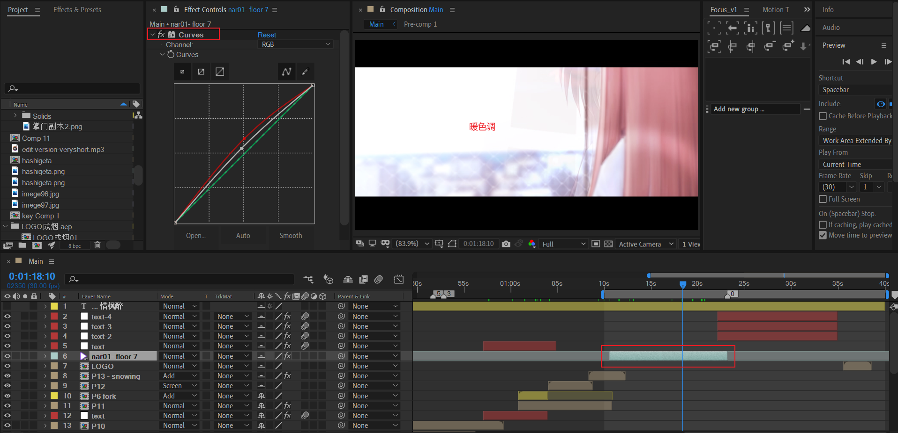
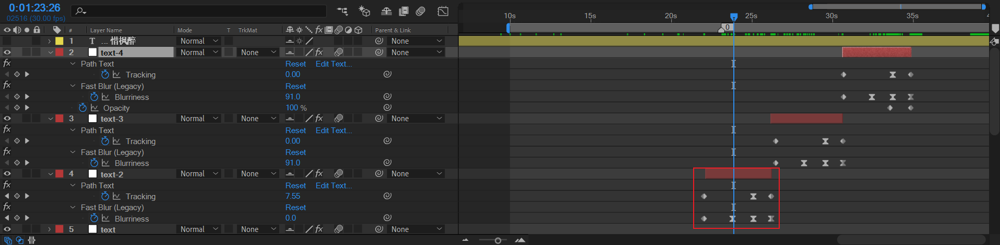
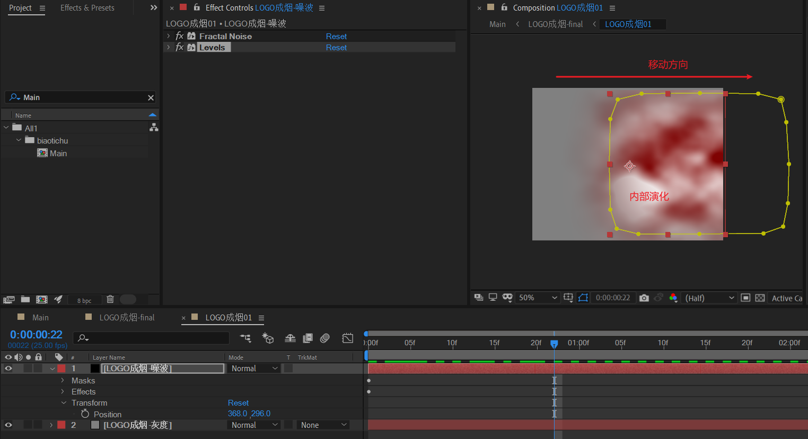
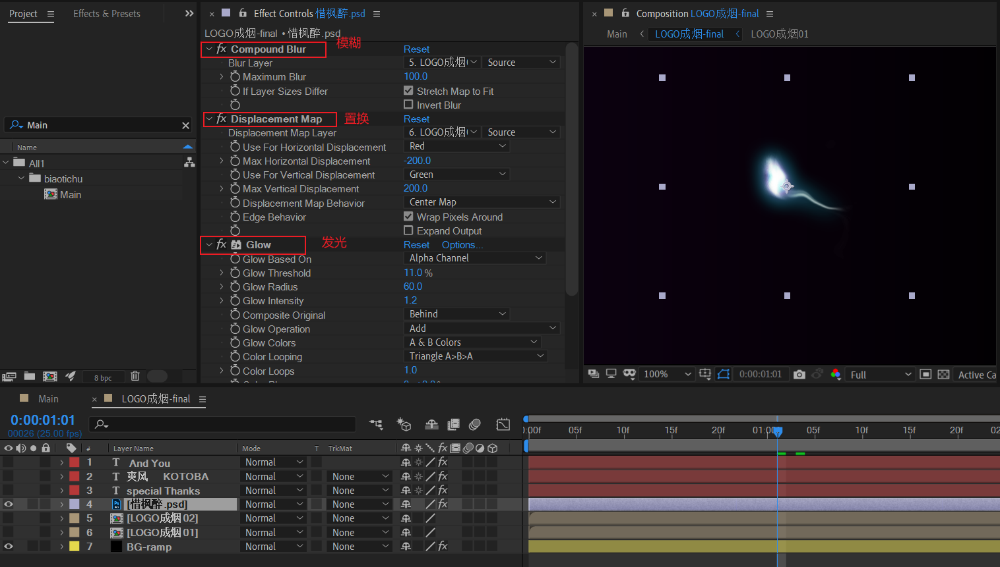
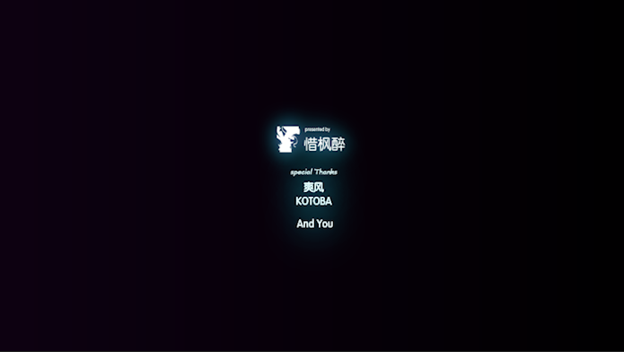

# 14 电梯与七楼

## 视频长片段——暖色调

## 文案

语句1：“体会了最后的梦想……”

语句2：“这些就足够了……”

语句3：“ｎａｒｃｉｓｓｕ”

这些语句的关键帧基本保持一致。可以重复使用。

- 字符间隔从0到整数，然后到负数。
- 模糊度为入场和出场模糊，中间显示时保持0。

## 作者LOGO

### 分形噪波演化

### LOGO

其余三个文本也是类似的制作原理。差异化分形噪波，梅花三弄就行。

很好，所有独立合成的拆解已经完成。

