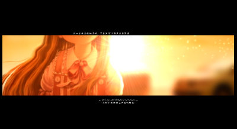

# 15 运镜分析

在前面的章节中，我们已经对各个主分镜（P？）进行了实现层面的分析。现在，我们将从整体的角度，来观察运镜。

这里，不会再分析任何实现层面的细节，而是从分镜设计的角度来分析这个MAD。

| 序号（P） | 时间范围  | 音乐节奏 | 画面截图                                                     | 说明                                                         |
| --------- | --------- | -------- | ------------------------------------------------------------ | ------------------------------------------------------------ |
| 1         | 0-24      | 缓慢     |  | 跟随缓慢的音乐前奏，这里使用了多个对白来交代一些故事的背景。 |
| 1         | 24-28     | 缓慢     |  | 跟随缓慢的音乐节奏，流云往上方缓慢流动。中间文本交代故事标题。 |
| 1         | 28-30     | 快速切换 |  | 音乐多个鼓点切换，此时采用多个画面，交错移动，不断闪烁。来呼应音乐节奏。 |
| 1         | 30-32     | 缓慢     |  | 镜头缓慢拉远，人物从右侧出场，交代故事的开始。               |
| 2         | 32-34     | 缓慢     |  | 黑边模式，转换场景。上下文本。左右侧景深交替：清晰度交替。   |
| 3         | 34-35     | 缓慢     |  | 切换到花海场景。文本汇聚成单词，表示记忆。                   |
| 4         | 35-37     | 缓慢     |  | 镜头拉远，然后观察视角移到上方，出现天空。这个做法非常常见。 |
| 4         | 37-38     | 缓慢     |  | 天空淡出后，居中出现文本。背景叠化成淡粉色。                 |
| 5         | 38-40     | 缓慢     |  | 模拟海滩场景，镜头拍摄效果。这里手环掉落到水中，激起层层涟漪。 |
| 6         | 40-41     | 缓慢     |  | 切换到另一个花海场景。拍摄角度为从花丛中，望向远方，镜头一直后退，缓慢旋转。 |
| 6         | 41-42     | 缓慢     |  | 切换到女孩腿部特写。镜头缓缓上移。                           |
| 6         | 42-42.5   | 缓慢     |  | 切换到女孩上半身特写。镜头缓缓上移。                         |
| 7         | 42.5-43   | 缓慢     |  | 切换场景到树林场景，居中文本继续渲染气氛。                   |
| 7         | 43-44     | 缓慢     |  | 切换到室外阳光场景。                                         |
| 8         | 44-46     | 缓慢     |  | 花海场景，蝴蝶飞舞。这里重复小合成来点缀画面。               |
| 8         | 46-48     | 缓慢     |  | 女孩从左侧进入到中间，然后下移淡出。居中文本，上移淡出。     |
| 9         | 48-50     | 缓慢     |  | 钥匙掉落，同时压黑边。中间区域背景图片不断叠化。             |
| 10        | 50-57     | 缓慢     |  | 多个视频场景缓慢叠化。节奏非常舒缓。                         |
| 10        | 57-59     | 缓慢     |  | 多个图片快速叠化到居中位置，然后淡出。背景视频缓慢播放，这里是慢速特写。结尾处，画面和音乐戛然而止。 |
| 10        | 59-1:00   | 缓慢     |  | 这里插入一个黑底白字的画面。                                 |
| 11        | 1:00-1:03 | 缓慢     |  | 重用了之前花海的场景，前景设置一个不断飘舞的花瓣。叠加各种打光。 |
| 12        | 1:03-1:09 | 缓慢     |  | 使用一个时钟意向，来表示生命的尽头。                         |
| 13        | 1:09-1:10 | 缓慢     |  | 路边下雪的场景。加剧悲凉的气氛。                             |
| 14        | 1:10-1:22 | 缓慢     |  | 这里直接使用游戏OP的视频片段，持续时间很长。场景是：电梯，七楼。 |
| 14        | 1:22-1:35 | 缓慢     |  | 居中文本。3组。                                              |
| 14        | 1:35-end  | 缓慢     |  | 末尾关于制作的说明。                                         |

